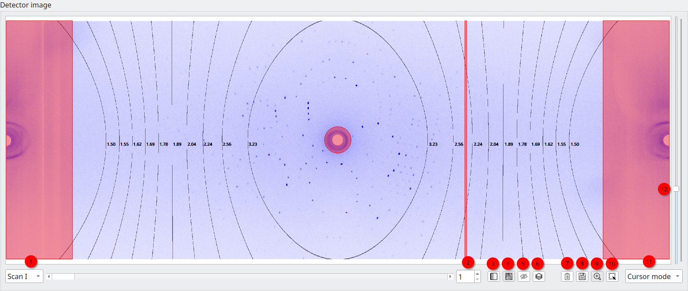
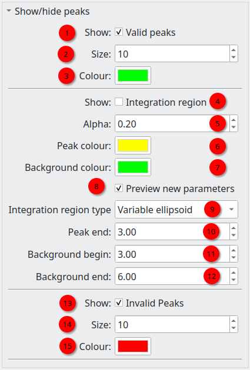

.. _detectorview:

Detector image widget
=====================

.. _detector_image:

   The detector image

Most panels of the OpenHKL GUI contain some variation of the detector image
widget, showing a single image from the data set (selectable via (1)). The
scroll bar and spin box (2) can be used to cycle through the images in order,
and the slider on the right of the widget used to adjust the maximum intensity
of the colour map, which is useful for visually enhancing low contrast images.

In addition, there is a toolbar with several more controls:

3. Switch between normal image and image gradient
4. Toggle the resolution contours on and off
5. Toggle the detector masks on and offer
6. Toggle Miller indices of peaks on and off
7. Copy the image with all overlays to the clipboard
8. Save the image with all overlays to a file
9. Zoom select tool
10. Rectangle select tool
11. Change the information displayed in the tooltip attached to the cursor

The detector widget is by default in zoom mode, in which the user can drag a
rectangular selection box, which will be zoomed into when the mouse button is
released. A right mouse button click will zoom out one level.

Cursor mode
~~~~~~~~~~~

The ``Cursor mode`` combo box changes the information displayed in the tooltip
attached to the mouse cursor when hovering over a pixel in the detector image.
The options are:

1. ``Pixel`` --- the pixel coordinates (x, y) followed by the count of the
   pixel

2. :math:`\theta` --- the diffraction angle :math:`\theta` followed by the
   count

3. :math:`\gamma / \nu` --- the instrument angles :math:`\gamma` and
   :math:`\nu`, followed by the count

4. ``d`` --- The lattice spacing ``d`` from Bragg's law followed by the
   count

5. ``Miller index`` --- the non-integer Miller index :math:`(h k l)` followed by
   the count

Show/hide peaks widget
======================

.. _peak_view_widget:

   The show/hide peaks widget

Every detector widget has an assocated widget to change the peak visualisatioon
settings on the control panel on the left of the application, in most cases,
this is labeled ``Show/hide peaks``. It enables control of three different
aspects of the information superimposed on the detector image:

Valid peaks
~~~~~~~~~~~

Plot peak centres as circles on the detector image.

1. Show or hide the valid peaks (peaks which are ``selected`` and *not*
   ``masked``)
2. Change the size of the circle indicating the centre of the peak
3. Change the colour of the circle indicating the centre of the peak

Integration Regions
~~~~~~~~~~~~~~~~~~~

Generate an overlay indicating the peak intensity regions (default green) and
background regions (default yellow).

4. Show or hide the integration regions
5. Change the alpha (transparency) of the integration regions; 0 = transparent,
   1 = opaque.
6. Set the colour of the peak (intensity) region
7. Set the colour of the background region      
8. Preview the integration regions. If this is checked, the integration
   parameters below are used to determine the size of the integration regions.
   If unchecked, the integration regions are determined from the parameters used
   last time the peaks were integrated.
9. Peak region size (see :ref:`sec_peakshape`)
10. Beginning of background region (see :ref:`sec_peakshape`)
11. End of background region (see :ref:`sec_peakshape`)

Invalid peaks
~~~~~~~~~~~~~

Plot peaks that have for some reason been disabled as circles on the detector
image.

13. Show or hide the invalid peaks
14. Change the size of the circle indicating the centre of the peak
15. Change the colour of the circle indicating the centre of the peak
