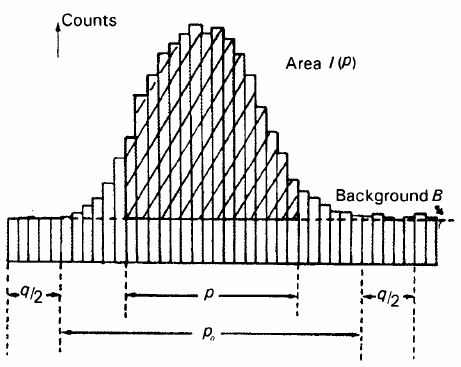

.. _integration:

Integration
===========

Peaks on a set of detector images are integrated to determine their
intensity and variance by summing up the counts in pixels assigned to
their respective peaks. There are four basic steps
:cite:`i-Kabsch2010`:

1. **Determination of the reflection mask** — the definition of
   integration regions for each peak.

2. **Background determination** — division of pixels in the integration
   region into subsets of peak and background pixels, computing a mean
   background level.

3. **Reference profile generation** — strong peaks are used to generate
   mean profiles, and weak peaks are integrated using a profile
   generated as the mean of neighbouring strong profiles.

4. **Integration by profile fitting** — summing the peak pixels to
   determine the intensity and variance of the peaks.

There are five main integrators implemented in OpenHKL. The pixel sum
integrator is the most lightweight and naive, since it does not use any
form of profile fitting. It is intended to generate an initial guess for
the intensities. The 1D (used in DENZO) and 3D (used in XDS) Profile
integrators :cite:`i-Kabsch1988,i-Kabsch2010,i-Kabsch2010a` use
the same least squares fitting procedure, but the 1D method uses the
distance of the pixel from the elliptical peak centroid to fit a
profile, whereas the 3D method uses all pixel coordinates. The
:math:`I/\sigma` integrator :cite:`i-Wilkinson1988,i-Prince1997`
uses the Lehman-Larsen :math:`sigma/I` criterion to distinguish the peak
and background regions. Finally, the Gaussian integrator assumes a
Gaussian profile shape.

.. _sec_pixelsum:

Pixel sum integration
---------------------

For a peak :math:`Q` in sample-fixed reciprocal space, the
background-subtracted intensity distrubution in the neighbourhood of
:math:`Q` has a covariance matrix :math:`\Sigma` that is either computed
for strong peaks, or predicted for weak peaks. The pixel sum integration
routine takes three parameters, :math:`r_1`, :math:`r_2` and :math:`r_3`
and produces two sets :math:`\mathcal{B}` and :math:`\mathcal{P}` of
background and peak pixels respectively:

.. math::

   \begin{aligned}
    \mathcal{P} &= \{ p ~|~ (\mathbf{q}_p-\mathbf{Q})^\intercal
   \mathbf{\Sigma}^{-1} (\mathbf{q}_p-\mathbf{Q}) < r_1^2 \} \\ \mathcal{B} &= \{ p
   ~|~ r_2^2 < (\mathbf{q}_p-\mathbf{Q})^\intercal \mathbf{\Sigma}^{-1}
   (\mathbf{q}_p-\mathbf{Q}) < r_3^2 \}\end{aligned}

\ The local background is estimated as

.. math::

   \begin{aligned}
    \mu_B &= \frac{1}{|\mathcal{B}|} \sum_{p \in \mathcal{B}} M_p \\
   \sigma^2_B &= \frac{1}{|\mathcal{B}|-1} \sum_{p \in \mathcal{B}} (M_p - \mu_B)^2\end{aligned}

This integrator is somewhat naïve since it does not employ any profile
fitting, and is used only to get a rough estimate of intensities. The
final integration should be performed using a more rigorous integrator
(see below).

.. _sec_3dprofile:

3D Profile integration
----------------------

This method is employed by XDS :cite:`i-Kabsch2010a`, and is described in more
detail in :ref:`theory`.

For the intensity distribution :math:`\{ p_i | i \in D_0 \}` of a
profile :math:`p_i` in domain :math:`D_0`, the intensity of the observed
peak is,

.. math::

   I = \frac{\sum_{i \in D}(c_i - b_i)p_i/v_i}{\sum_{i \in
   D}p_i^2/v_i},

\ where :math:`c_i`, :math:`b_i`, :math:`v_i` and :math:`p_i` are the
contents (i.e. count), background, variance and profile of pixel
:math:`i` in the subdomain :math:`D
\subseteq D_0`. This minimises the chi-squared loss,

.. math::
   :label: eq_psi

   \psi(I) = \sum_{i \in D}(c_i - I\cdot p_i -
   b_i)^2/v_i,

subject to the normalisation :math:`\sum_{i \in D_0}p_i = 1`. The
background is assumed to be constant, and is estimated from the
neighbourhood of the reflection; variations on this method normally
differ in their assumptions with respect to the variace :math:`v_i`. The
variance is computed as in DENZO, as,

.. math::
   :label: eq_variance
   
   v_i = b_i - I\cdot p_i

Starting with :math:`v_i = b_i`, the intensity is computed iteratively,
stopping when it becomes negative or smaller than some tolerance. This
normally takes no more than three cycles.

We minimise equation :eq:`eq_psi` with respect to the
intensity and profile count by setting :math:`\partial\psi/\partial I`
and :math:`\partial\psi/\partial p_i` to zero for fixed variances,
resulting in the 2x2 linear system,

.. math::
   :label: eq_leastsq

     \begin{bmatrix} \sum 1/v_i^2 && \sum p_i/v_i^2 \\ p_i/v_i^2 &&
   p_i^2/v_i^2 \end{bmatrix}
     \begin{bmatrix} B \\ I \end{bmatrix} =
     \begin{bmatrix} \sum c_i/v_i^2 \\ \sum c_ip_i/v_i^2 \end{bmatrix}

In OpenHKL, the following procedure is used to solve these equations:

#. Set :math:`v_i = b_i` as an initial guess

#. Solve equations :eq:`eq_leastsq` by inversion

#. compute updated :math:`v_i` from equation :eq:`eq_variance`

#. repeat from step 2 until
   convergence.

1D Profile integration
----------------------

This method is used in DENZO :cite:`i-Kabsch2010`, and is
similar to 3D profile integration, since the same least squares fitting
procedure is employed. However, in this instance the 3D coordinates of
pixels are replaced with a 1D “radius” from the centroid of the
ellipsoid peak.

I/:math:`\sigma` integration
----------------------------

The Lehman-Larsen :math:`\sigma/I` criterion states that the boundary
between the peak and background region occurs when :math:`\sigma(I)/I`
is a minimum with respect to the peak of the reflection. This works in
practice for 1D profiles, but fails for 2D and 3D profiles due to
statistical fluctuations in the background, the increase computational
expense and the increase difficulty in choosing which points to test for
the criterion. It can, however, be made to work if the peak shape is
known from statistically well-observed (strong) neighbouring peaks.

.. _isigma:

   Peak profile for :math:`\sigma /I` integration :cite:`i-Prince1997`

For a peak containing :math:`p_0` points, with total integrated
intensity :math:`I(p_0)`, define a intensity contour containing
:math:`p` points with integrated intensity :math:`I(p)` (see
figure). the points :math:`p` are a fraction :math:`x(p)`
of the total :math:`p_0`. The background is determined from :math:`q/2`
grid points either side of the peak boundary. The minimum of
:math:`\sigma(I)/I` occurs when,

.. math::
   :label: isigma1

     \frac{d(p/p_0)}{dx} - 2\frac{(p/p_0)}{x} = \frac{I_0}{p_0B},

is satisfied. For a strong peak (:math:`I_0/p_0B \gg 1`), the minimum
will be close to :math:`p_0`, and the parameters for such peaks are used
to on the left-hand side of equation :eq:`eq_isigma1` to
predict the minimum of :math:`\sigma(I)/I` for weak reflections. The aim
is to minimise :math:`\sigma(I_0) = \sigma(I/x)` for weak reflections.
If the intensity of the weak peak is a small fraction of that of the
strong profile peak, it can be shown that :math:`\sigma(I/x)` coincides
with :math:`\sigma(I)/I` :cite:`i-Wilkinson1988`, where
:math:`I_0 = I(p_0) = I/x`. In practice, we measure :math:`x(p)` from a
strong peak with the same shape, and since the errors in :math:`I` and
:math:`1/x` are independent,

.. math:: \frac{\sigma^2(I/x)}{(I/x)^2} = \frac{\sigma^2(1/x)}{(1/x)^2} + \frac{\sigma^2(I)}{I^2},

and we take the find the numerical minimum,

.. math:: \textrm{argmin}\left( \frac{\sigma^2(p)}{p^2} + \frac{\sigma^2(I)}{I^2} \right)

See :ref:`sec_isigma` for more details.

Gaussian integration
--------------------

.. bibliography:: references.bib
    :cited:
    :labelprefix: I
    :keyprefix: i-
    :style: unsrt

Go to :ref:`top <integration>`.
