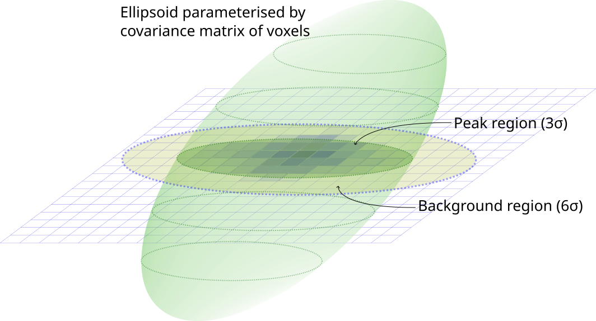
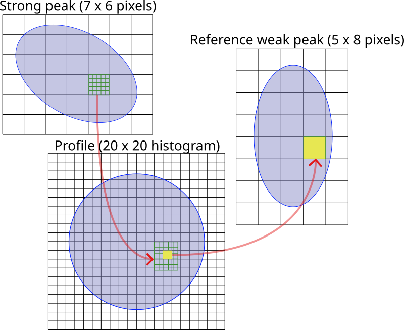

.. _theory:

Theory
========

.. _peak-finding:

Image processing
----------------

The first step of extracting features from a detector image is the application
of a filter, also known as convolution. A convolution kernel is a small matrix
that operates on every element (pixel) of an image, combining it with the
surrounding pixels in a convolution, resulting in some modification of the image
that makes it easier to process, for example, sharpening, blurring or
edge-finding.

The general expression for convolution is,

.. math::

   g(x, y) = w * f(x, y) = \sum^a_{dx=-a}\sum^b_{dx=-b}w(dx, dy)f(x-dx, y-dy),

where :math:`g(x, y)` is the filtered or transformed image, :math:`f(x, y)` is
the original image, and :math:`w` is the convolution kernel matrix. This is
roughly equivalent to a weighted average of the elements of a sub-matrix of the
image with the same dimensions as the kernel (the weight being the value of the
element in the kernel), applied to the central element of the sub-matrix.

The effect of the filter obviously depends on the form of the convolution
kernal, of which there are 5 types.

1. Delta

   A dirac delta function that does not modify the image.

.. math::

   \begin{bmatrix}
   0 & 0 & 0 \\
   0 & 1 & 0 \\
   0 & 0 & 0
   \end{bmatrix}

2. Constant

   Apply a blur, as the average over the pixels surrounding a central pixel. A 3
   x 3 example:

.. math::

   \frac{1}{9}
   \begin{bmatrix}
   1 & 1 & 1 \\
   1 & 1 & 1 \\
   1 & 1 & 1
   \end{bmatrix}

3. Radial

   Taking elements in a radius between :math:`r_1` and :math:`r_2` to be one,
   and normalising by the sum of the elements of the matrix, this either becomes
   a notionally circular filter that has the same effect as a constant filter,
   or an annulus. Not generally of interest itself, but used to construct the
   annular kernel. The following (unnormalised) example has :math:`r_1 = 10` and
   :math:`r_2 =
   15`.

.. math::

  \begin{bmatrix}
  0 & 0 & 0 & 0 & 0 & 1 & 1 & 1 & 1 & 1 & 0 & 0 & 0 & 0 & 0 \\
  0 & 0 & 0 & 1 & 1 & 1 & 1 & 1 & 1 & 1 & 1 & 1 & 0 & 0 & 0 \\
  0 & 0 & 1 & 1 & 1 & 1 & 1 & 1 & 1 & 1 & 1 & 1 & 1 & 0 & 0 \\
  0 & 1 & 1 & 1 & 1 & 0 & 0 & 0 & 0 & 0 & 1 & 1 & 1 & 1 & 0 \\
  0 & 1 & 1 & 1 & 0 & 0 & 0 & 0 & 0 & 0 & 0 & 1 & 1 & 1 & 0 \\
  1 & 1 & 1 & 0 & 0 & 0 & 0 & 0 & 0 & 0 & 0 & 0 & 1 & 1 & 1 \\
  1 & 1 & 1 & 0 & 0 & 0 & 0 & 0 & 0 & 0 & 0 & 0 & 1 & 1 & 1 \\
  1 & 1 & 1 & 0 & 0 & 0 & 0 & 0 & 0 & 0 & 0 & 0 & 1 & 1 & 1 \\
  1 & 1 & 1 & 0 & 0 & 0 & 0 & 0 & 0 & 0 & 0 & 0 & 1 & 1 & 1 \\
  1 & 1 & 1 & 0 & 0 & 0 & 0 & 0 & 0 & 0 & 0 & 0 & 1 & 1 & 1 \\
  0 & 1 & 1 & 1 & 0 & 0 & 0 & 0 & 0 & 0 & 0 & 1 & 1 & 1 & 0 \\
  0 & 1 & 1 & 1 & 1 & 0 & 0 & 0 & 0 & 0 & 1 & 1 & 1 & 1 & 0 \\
  0 & 0 & 1 & 1 & 1 & 1 & 1 & 1 & 1 & 1 & 1 & 1 & 1 & 0 & 0 \\
  0 & 0 & 0 & 1 & 1 & 1 & 1 & 1 & 1 & 1 & 1 & 1 & 0 & 0 & 0 \\
  0 & 0 & 0 & 0 & 0 & 1 & 1 & 1 & 1 & 1 & 0 & 0 & 0 & 0 & 0
  \end{bmatrix},

4. Annular

   Consists of two regions: firstly, between 0 and :math:`r_1`, with a positive
   value, and secondly, between :math:`r_2` and :math:`r_3`, with a negative
   value. This is equivalent to the sum of two radial kernels, with parameters
   :math:`\{0, r_1\}` and :math:`\{r_2, r_3\}` respectively, each individually
   normalised to the sum of its elements. The following (unnormalised) example
   has parameters :math:`r_1 = 5`, :math:`r_2 = 10` and :math:`r_3 = 15`. The
   overall effect is a local average with a local mean background subtraction.

.. math::

  \begin{bmatrix}
  0 & 0 & 0 & 0 & 0 &-1 &-1 &-1 &-1 &-1 & 0 & 0 & 0 & 0 & 0 \\
  0 & 0 & 0 &-1 &-1 &-1 &-1 &-1 &-1 &-1 &-1 &-1 & 0 & 0 & 0 \\
  0 & 0 &-1 &-1 &-1 &-1 &-1 &-1 &-1 &-1 &-1 &-1 &-1 & 0 & 0 \\
  0 &-1 &-1 &-1 &-1 & 0 & 0 & 0 & 0 & 0 &-1 &-1 &-1 &-1 & 0 \\
  0 &-1 &-1 &-1 & 0 & 0 & 0 & 0 & 0 & 0 & 0 &-1 &-1 &-1 & 0 \\
  1 &-1 &-1 & 0 & 0 & 0 & 1 & 1 & 1 & 0 & 0 & 0 &-1 &-1 &-1 \\
  1 &-1 &-1 & 0 & 0 & 1 & 1 & 1 & 1 & 1 & 0 & 0 &-1 &-1 &-1 \\
  1 &-1 &-1 & 0 & 0 & 1 & 1 & 1 & 1 & 1 & 0 & 0 &-1 &-1 &-1 \\
  1 &-1 &-1 & 0 & 0 & 1 & 1 & 1 & 1 & 1 & 0 & 0 &-1 &-1 &-1 \\
  1 &-1 &-1 & 0 & 0 & 0 & 1 & 1 & 1 & 0 & 0 & 0 &-1 &-1 &-1 \\
  0 &-1 &-1 &-1 & 0 & 0 & 0 & 0 & 0 & 0 & 0 &-1 &-1 &-1 & 0 \\
  0 &-1 &-1 &-1 &-1 & 0 & 0 & 0 & 0 & 0 &-1 &-1 &-1 &-1 & 0 \\
  0 & 0 &-1 &-1 &-1 &-1 &-1 &-1 &-1 &-1 &-1 &-1 &-1 & 0 & 0 \\
  0 & 0 & 0 &-1 &-1 &-1 &-1 &-1 &-1 &-1 &-1 &-1 & 0 & 0 & 0 \\
  0 & 0 & 0 & 0 & 0 &-1 &-1 &-1 &-1 &-1 & 0 & 0 & 0 & 0 & 0
  \end{bmatrix},

5. Enhanced annular

   This is similar to the annular kernel, but with a different normalisation.
   Instead of normalising two radial kernels separately, the enhanced annular
   kernel is normalised by the sum of the absolute values of the elements.

The next state is thresholding, i.e. discarding any pixel with a count below the
threshold value. After this point, it is possible to use either a `standard
blob-finding algorithm <https://en.wikipedia.org/wiki/Blob_detection>`_ or an
OpenCV implementation to detect connected components in the image. The
difference between the OpenCV implementation in the Experiment section, and the
proprietary implementation in the Peak Finder section is that the latter merges
blobs across images to form what is notionally a 3D model, the third dimension
being perpendicular to the plane of the images.

.. _peak-prediction:

Shape Prediction
----------------

.. _sec_peakshape:

Definition of peak shape
~~~~~~~~~~~~~~~~~~~~~~~~

In image analysis (peak finding), contiguous blobs (notionally detector spots)
are used to construct an ellipsoid in 3D space (two detector coordinates and the
frame number). This blob can be parameterised in terms of the moments of mass:
the zeroth (total mass) :math:`m_0`, the first :math:`\mathbf{m}_1` and second
(moment of inertia) :math:`M_2`. These can be used to compute the inertia
matrix, or variance/covariance matrix.

.. math::

   \begin{aligned}
   C = \frac{1}{m_0}M_2 - \frac{1}{m_0}\mathbf{m}_1
   \end{aligned}

The metric tensor of the ellipsoid :math:`A` d is then the inverse of
covariance, i.e. :math:`A = C^{-1}`. The eigenvalues of the covariance matrix
(:math:`\Lambda` in :math:`3\times 3` diagonal matrix form) of an ellipsoid
defines the radii around the principal axes, or alternatively the *variances* in
the directions of the principal axes. The eigenvalues (:math:`U` as a matrix)
define the principal axes. These are related by :math:`CU = V\Lambda`, thus the
metric tensor can be derived from eigenvectors and eigenvalues via :math:`A =
U\Lambda^{-1}U^T`.

When constructing integration regions, we construct a central ellipsoid
representing the peak, and a second concentric ellipsoid to represent the
background. A third ellipsoid of intermediate radius may defin the beginning of
the background region such that there is an ignored or "guard" region between
the peak and background. If we interpret the eigenvalues :math:`\sigma_i, (i =
1, 2, 3)` as the square root of thevariance in the direction of the principal
axes, then scaling the peak ellipsoid by :math:`3\sigma` means that 99.7% of the
points are contained in the peak region.

.. _finder_params:

   Integration region ellipsoid

An example is sketched above. The dotted ellipses are the integration regions
where the ellipsoids intersects the detector images. The grid is a single image,
each square representing one pixel. The principle axis of the ellipsoid is not
generally perpendicular to the image plane, so centre of the ellipse
intersecting the image will vary from frame to frame, as the sample rotates.

There are two schemes for defining an integration region in OpenHKL:

1. *Variable ellipsoid* --- The peak and background ellipsoids are bounded using
   three parameters: peak end, background begin and background end, all of which
   are scaling factors. The peak ellipsoid is defined by the covariance matrix
   of a blob of voxels in the case of strong peaks, and as the mean covariance
   of neighbouring strong peaks in the case of weak peaks. The covariance matrix
   is scaled by the peak end factor to define the peak region, and the shell
   between the covariance matrix scaled by background begin and background end
   defines the background region. All three of these parameters are in units of
   multiples of :math:`\sigma`, the covariance of the ellipsoid.

2. *Fixed ellipsoid* --- The peak region is defined by the "mean radius" of the
   covariance ellipsoid in pixels; this is simply the mean of the half principal
   axes of the ellipsoid. The background begin and background end are scaling
   factors, which multiply the peak region.

The variable ellipsoid scheme is more natural, since it only requires three
scaling factors; however, weak peaks with large variances will necessarily have
larger integration regions, which is usually undesirable. Thus the fixed
ellipsoid scheme is normally preferable.

.. _beam_profile:

Rotating the beam profile
~~~~~~~~~~~~~~~~~~~~~~~~~

We make a simplifying assumption, that for a *perfect plane wave* :math:`{\mathbf{{k}}}_\text{i}`, the observed scattering function has the form

.. math::

   \sum_{hkl}
   I_{hkl} f({\mathbf{{q}}}- {\mathbf{{q}}}_{hkl}),

\ i.e. that the peak shape is independent of its intensity and Miller
index, specified by a single function :math:`f({\mathbf{{q}}})`.

Now suppose that the incoming plane wave actually has momentum
:math:`{\mathbf{{k}}}_\text{i}+ \delta
{\mathbf{{k}}}_\text{i}`, with :math:`\delta {\mathbf{{k}}}_\text{i}` sampled
from a probability distribution :math:`P(\delta
{\mathbf{{k}}}_\text{i})`. Let :math:`\mathbf{{u}}` be the unit vector pointing
from the sample origin to a given detector pixel. As we only consider
elastic scattering, we can write the wavenumber as
:math:`K:= k_\text{i}= k_\text{f}`. Then the outgoing momentum
associated with this pixel is

.. math::

   \begin{aligned}
     |{\mathbf{{k}}}_\text{i}+ \delta {\mathbf{{k}}}_\text{i}| \mathbf{{u}}&= \mathbf{{u}}\sqrt{K^2 + 2 {\mathbf{{k}}}_\text{i}\cdot \delta {\mathbf{{k}}}_\text{i}+
   (\delta {\mathbf{{k}}}_\text{i})^2 } \\ &\doteq \mathbf{{u}}\sqrt{K^2 + 2 {\mathbf{{k}}}_\text{i}\cdot \delta {\mathbf{{k}}}_\text{i}} \\
   &= \mathbf{{u}}K\sqrt{1+ 2\frac{{\mathbf{{k}}}_\text{i}\cdot \delta {\mathbf{{k}}}_\text{i}}{K^2}} \\ &\doteq \mathbf{{u}}K
   \left(1 + \frac{{\mathbf{{k}}}_\text{i}\cdot \delta {\mathbf{{k}}}_\text{i}}{K^2}\right) \\ &= {\mathbf{{k}}}_\text{f}+ \delta
   {\mathbf{{k}}}_\text{f},\end{aligned}

where :math:`{\mathbf{{k}}}_\text{f}= \mathbf{{u}}K` and
:math:`\delta {\mathbf{{k}}}_\text{f}= \mathbf{{u}}({\mathbf{{k}}}_\text{i}\cdot \delta {\mathbf{{k}}}_\text{i}) /
K`. Therefore, we have

.. math::

   \delta{\mathbf{{q}}}= \delta {\mathbf{{k}}}_\text{f}- \delta {\mathbf{{k}}}_\text{i}= \mathbf{{u}}({\mathbf{{k}}}_\text{i}\cdot \delta {\mathbf{{k}}}_\text{i}) / K
   - \delta {\mathbf{{k}}}_\text{i}= \mathbf{{A}} \delta {\mathbf{{k}}}_\text{i},

where :math:`\mathbf{{A}}` is the matrix

.. math:: \mathbf{{A}} := K^{-1} \mathbf{{u}}{\mathbf{{k}}}_\text{i}^\intercal- \mathbf{{1}} = K^{-2} {\mathbf{{k}}}_\text{f}{\mathbf{{k}}}_\text{i}^\intercal- \mathbf{{1}}.

Note that :math:`\mathbf{{A}} {\mathbf{{k}}}_\text{i}= {\mathbf{{q}}}` and therefore
:math:`{\mathbf{{q}}}+ \delta {\mathbf{{q}}}= \mathbf{{A}}({\mathbf{{k}}}_\text{i}+
\delta {\mathbf{{k}}}_\text{i})`.

Therefore, the observed intensity at detector position :math:`(x,y)`
should be proportional to

.. math::

   \begin{aligned}
     &= \int f({\mathbf{{q}}}- {\mathbf{{q}}}_{hkl} + \delta {\mathbf{{q}}}) P(\delta {\mathbf{{k}}}_\text{i}) d(\delta {\mathbf{{k}}}_\text{i}) \\
     &= \int f({\mathbf{{q}}}- {\mathbf{{q}}}_{hkl} + \mathbf{{R}}\mathbf{{A}} \delta {\mathbf{{k}}}_\text{i}) P(\delta {\mathbf{{k}}}_\text{i}) d(\delta {\mathbf{{k}}}_\text{i})\end{aligned}

where :math:`\mathbf{{R}}` is the rotation matrix taking lab coordinates to
sample-fixed coordinates. The matrix :math:`\mathbf{{A}}` has
:math:`\det \mathbf{{A}} = -\frac{1}{2}{\mathbf{{q}}}^2` and therefore is
invertible. [1]_ So we have
:math:`\delta {\mathbf{{k}}}_\text{i}= A^{-1} \delta {\mathbf{{q}}}` and
:math:`d(\delta {\mathbf{{k}}}_\text{i}) = |\det \mathbf{{A}}|^{-1}
d(\delta {\mathbf{{q}}})`. Let :math:`\mathbf{{\Sigma}}_M` denote the
variance-covariance matrix of the profile shape :math:`f` and let
:math:`\mathbf{{\Sigma}}_D` denote the variance-covariance matrix of the
beam divergence :math:`\delta {\mathbf{{k}}}_\text{i}`. Then from the above
formula we see that the *observed* profile shape will have (in
sample-fixed q-space) a variance-covariance matrix given by

.. math::
     :label: ESigmaMD

     \mathbf{{\Sigma}}_M + \mathbf{{R}} \mathbf{{A}} \mathbf{{\Sigma}}_D \mathbf{{A}}^\intercal\mathbf{{R}}^\intercal,

where :math:`R` is the rotation matrix from lab space to sample space
and :math:`\mathbf{{A}} =
K^{-2} {\mathbf{{k}}}_\text{f}{\mathbf{{k}}}_\text{i}^\intercal- \mathbf{{1}}`. Note
that the matrix :math:`\mathbf{{A}}` depends only on
:math:`{\mathbf{{k}}}_\text{f}`, i.e. on the detector pixel location, and
the matrix :math:`\mathbf{{R}}` depends on the sample orientation, i.e. the
frame number.

Now make a simplifying assumption,
:math:`\mathbf{{\Sigma}}_M = \sigma_M^2 \mathbf{{1}}` and :math:`\mathbf{{\Sigma}}_D
= \sigma_D^2 \mathbf{{1}}` so that the expected variance-covariance matrix
:eq:`ESigmaMD` becomes

.. math::
   :label: ESigmaMD2

     \mathbf{{\Sigma}}(\sigma_M,\sigma_D) = \mathbf{{\Sigma}}_M + \mathbf{{R}} \mathbf{{A}} \mathbf{{A}}^\intercal\mathbf{{R}}^\intercal,

Consider :math:`N` observed blobs parameterized by
:math:`(\mathbf{{\Sigma}}_b, \mathbf{{R}}_b, \mathbf{{A}}_b)`. Write
:math:`\mathbf{{S}}_b:=\mathbf{{R}}_b\mathbf{{A}}_b`. Form the penalty
function

.. math::

   L(\sigma_M^2, \sigma_D^2)
     = \sum_{b=1}^N
       \left|\sigma_M^2\mathbf{{1}} + \sigma_D^2 (\mathbf{{S}}_b)(\mathbf{{S}}_b)^\intercal- \mathbf{{\Sigma}}_b\right|^2

Determine :math:`\sigma_M^2` and :math:`\sigma_D^2` by minimizing the
difference between the empirical :math:`\mathbf{{\Sigma}}_b` and the
expectation :eq:`ESigmaMD2`. Set
:math:`\mathbf{{\nabla }}L = 0` to obtain the 2x2 system of linear equations

.. math::

   \begin{bmatrix}
       3N & \sum_b \mathrm{tr}( (\mathbf{{S}}_b)(\mathbf{{S}}_b)^\intercal) \\
       \sum_b \mathrm{tr}((\mathbf{{S}}_b)^\intercal(\mathbf{{S}}_b)) & \sum_b \mathrm{tr}(((\mathbf{{S}}_b)^\intercal(\mathbf{{S}}_b))^2)
     \end{bmatrix}
     \begin{bmatrix}
       \sigma_M^2 \\
       \sigma_D^2
     \end{bmatrix}
     =
     \begin{bmatrix}
       \sum_b \mathrm{tr}(\mathbf{{\Sigma}}_b) \\
       \sum_b \mathrm{tr}((\mathbf{{S}}_b)^\intercal\mathbf{{\Sigma}}_b (\mathbf{{S}}_b))
     \end{bmatrix},

which is easily solved. One can also solve for the the full covariance
matrices :math:`\mathbf{{\Sigma}}_M, \mathbf{{\Sigma}}_D` via gradient descent,
since the gradient is easily computed analytically. [Here Jonathan says
he tested “this” out in Python, and it seemed to work pretty well, so
the assumptions may be justified. But we ignore whether “this” refers to
the simplified :math:`\mathbf{{\Sigma }}= \sigma^2 \mathbf{{1}}` or to the full
computation with arbitrary :math:`\mathbf{{\Sigma}}`.]

Now, if we work in lab-based q-space, under the simplifying assumptions
above, we find a covariance matrix **TODO: this is notationally wrong
and totally obscure**

.. math:: \mathbf{{\Sigma }}= \sigma_M^2 \mathbf{{1}} + \sigma_D^2 \mathbf{{A}}_b \mathbf{{A}}_b^\intercal

.. _kabschs-coordinate-system-1:

Kabsch’s Coordinate System
~~~~~~~~~~~~~~~~~~~~~~~~~~

In :cite:`t-Kabsch1988` Kabsch introduced a per-peak
coordinate system intented to undo effects from detector geometry. See
also :cite:`t-Kabsch2010` for an updated description of the
coordinates and integration technique. The basis introduced by Kabsch is
the following:

.. math::

   \begin{aligned}
     {\mathbf{{e}}}_1 &= ({\mathbf{{q}}}\times {\mathbf{{k}}}_\text{i}) / |{\mathbf{{q}}}\times {\mathbf{{k}}}_\text{i}| \\
     {\mathbf{{e}}}_2 &= ({\mathbf{{q}}}\times {\mathbf{{e}}}_1) / |{\mathbf{{q}}}\times {\mathbf{{e}}}_1| \\
     {\mathbf{{e}}}_3 &= ({\mathbf{{k}}}_\text{f}+ {\mathbf{{k}}}_\text{i}) / |{\mathbf{{k}}}_\text{f}+ {\mathbf{{k}}}_\text{i}|\end{aligned}

with corresponding coordinates

.. math::

   \begin{aligned}
     \epsilon_1 &= {\mathbf{{e}}}_1 \cdot ({\mathbf{{k}}}_\text{f}'-{\mathbf{{k}}}_\text{f}) / |{\mathbf{{k}}}_\text{f}| \\
     \epsilon_2 &= {\mathbf{{e}}}_2 \cdot ({\mathbf{{k}}}_\text{f}'-{\mathbf{{k}}}_\text{f}) / |{\mathbf{{k}}}_\text{f}| \\
     \epsilon_3 &= {\mathbf{{e}}}_3 \cdot (\mathbf{{R}}_{\phi'-\phi}{\mathbf{{q}}}-{\mathbf{{q}}}) / |{\mathbf{{q}}}|\end{aligned}

The coordinates :math:`\epsilon_1, \epsilon_2` correspond to the angular
distribution (in radians) of the peak, as if it were measured on the
Ewald sphere. Hence this corresponds to beam divergence and we may model
the intensity distribution as
:math:`\exp(-(\epsilon_1^2 + \epsilon_2^2)/2 \sigma_D^2)`.

To understand the last coordinate, consider the following. Take a peak
with center :math:`{\mathbf{{q}}}` and consider a nearby point
:math:`{\mathbf{{q}}}'`. We project :math:`{\mathbf{{q}}}'` back to the Ewald
sphere by rotating along the axis :math:`{\mathbf{{e}}}_1` (which is the
normal of the plane containing :math:`{\mathbf{{k}}}_\text{f}` and
:math:`{\mathbf{{k}}}_\text{i}`). The velocity of :math:`q` when it crosses
the Ewald sphere by rotating along this axis is
:math:`{\mathbf{{e}}}_1 \times {\mathbf{{q}}}`. It is easy to verify that

.. math:: {\mathbf{{e}}}_1 \times {\mathbf{{q}}}= q {\mathbf{{e}}}_3

and therefore the coordinate :math:`\epsilon_3` may be interpreted as
(approximately) and angular distance from the Ewald sphere.

To better understand :math:`{\mathbf{{e}}}_3`, consider the following: we
want to find the axis :math:`\mathbf{{a}}` such that :math:`{\mathbf{{q}}}`
passes through the Ewald sphere as fast as possible. Hence, we want to
maximize :math:`(\mathbf{{a}}\times {\mathbf{{q}}}) \cdot {\mathbf{{k}}}_\text{f}`
subject to the constraint :math:`\mathbf{{a}}\cdot \mathbf{{a}}= 1`. Now
:math:`(\mathbf{{a}}\times {\mathbf{{q}}}) \cdots {\mathbf{{k}}}_\text{f}) = \mathbf{{a}}\cdot (\mathbf{{a}}\times
{\mathbf{{k}}}_\text{f}) = \mathbf{{a}}\cdot
({\mathbf{{k}}}_\text{f}\times {\mathbf{{k}}}_\text{i})`, so by the method of
Langrange multipliers we must solve
:math:`{\mathbf{{k}}}_\text{f}\times {\mathbf{{k}}}_\text{i}= \lambda \mathbf{{a}}`,
which tells us immediately that the axis is in the direction of
:math:`{\mathbf{{e}}}_1`.

Least squares integration
-------------------------

.. _sec:app_profileint:

Fitted Intensity
~~~~~~~~~~~~~~~~

As shown in :cite:`t-Diamond1969`, the integration error for
weak peaks is dominated by background subtraction and it is typically
better to find the integrated intensity by fitting to a profile learned
from strong peaks.

3D profile fitting is used by XDS :cite:`t-Kabsch2010a` and is
described in some detail in :cite:`t-Kabsch1988,Kabsch2010`.

As in the previous subsection, using a covariance matrix and a
parameters :math:`r_1 <
r_2 < r_3` we produce sets :math:`\mathcal{P}` and :math:`\mathcal{B}`
of peak and background points. Assume that we know the resolution
function :math:`R_i`, normalized as

.. math::
   :label: Eresnor

     \sum_p R_p = 1.

We model the observed intensities :math:`M_p` as

.. math:: M_p \simeq B + I R_p,

where :math:`B, I` are the mean background and integrated intensity, yet
to be fit. To find optimal values of :math:`B,I` we minimize the
chi-squared loss

.. math:: \chi^2 = \sum_{p \in \mathcal{P}} \frac{(B+IR_p - M_p)^2}{\sigma^2_p}.

For a fixed set of variances, minimizing :math:`\chi^2` reduces to the
2x2 linear system below:

.. math::

   \begin{bmatrix}
       \sum 1/\sigma^2_p & \sum R_p / \sigma^2_p \\
       \sum R_p/\sigma_p^2 & \sum R_p^2 / \sigma^2_p
     \end{bmatrix}
     \begin{bmatrix}
       B \\
       I
     \end{bmatrix}
     =
     \begin{bmatrix}
       \sum M_p/\sigma^2_p \\
       \sum M_p R_p / \sigma^2_p
     \end{bmatrix}

Write this equation as :math:`Ax = b`. It is easy to compute that the
covariance matrix of :math:`b` is exactly the coefficient matrix
:math:`A`, and therefore the variance-covariance matrix of the solution
vector :math:`x = (B, I)` is given by :math:`A^{-1}`.

The solution given above depends on the pixel uncertainties
:math:`\sigma_p^2`. As suggested by Kabsch 2010, we solve this
iteratively. To begin, we set all :math:`\sigma^2_p` equal to some fixed
value, say 1. This allows us to solve for :math:`B` and :math:`I`. We
then put the solved values into the error model

.. math:: \sigma_p^2 = B + I R_p

and iterate until either :math:`I` becomes negative, or :math:`(B, I)`
do not change within some given convergence criterion.

.. _profile_fitting:

   Profile fitting process

The image above demonstrates the process of generating and fitting profiles in
practice. One or more strong peaks in the neighbourhood of a weak reference peak
are averaged over histogram with a different grid. In the image, a strong peak
with a 7 x 6 pixel bounding box is binned on a 20 x 20 histogram, which is
normalised after adding all of the neighbouring peaks. In practice, each pixel
of a strong peak is subdivided on a finer mesh, in this case, a 5 x 5 subgrid,
and 1/25 of the pixel signal is added to the relevant histogram bin. This
results in smoother profiles. When profile integrating a weak peak, the profile
value of pixel :math:`i`, :math:`p_i`, is taken from the nearest histogram bin.

.. _sec_isigma:

:math:`I/\sigma` Integration
----------------------------

This is the integration technique used by RETREAT . The method is
described in detail in :cite:`t-Wilkinson1988`. In the article
:cite:`t-Prince1997` there is a detailed comparison between
this method and profile fitting. For a given peak with mean background
:math:`\mu_b`, center :math:`x_0`, and covariance matrix
:math:`\mathbf{{\Sigma}}`, define

.. math::

   \begin{aligned}
     X_s &= \{ x \ | \ (x-x_0)^\intercal\mathbf{{\Sigma}}^{-1}(x-x_0) \leq s^2\} \\
     I_s &= \sum_{X_\sigma} I_x\end{aligned}

Then the error of :math:`I_\sigma` can be estimated (assuming Poisson
statistics) as

.. math:: \sigma^2(I_s) = I_s + n_s(1+\frac{n_s}{n_b}) \overline{B}

where :math:`n_s = |X_s|` is the number of points contributing to
:math:`I_\sigma` and :math:`n_b` is the number of points used for
background estimation.

**Important Remark:** The function :math:`I_\sigma` is, to a good
approximation, *independent of the coordinate system x*. It is an
*intrinsic* property of the intensity distribution, independent of the
coordinates used to express the distribution. We therefore do not have
to worry about changes of coordinates, as in Kabsch’s paper.

Now, suppose that we take some value :math:`t` to be the cutoff for
strong peak integration. We can define the integrated peak profile

.. math:: p_s := I_s / I_t

The uncertainty in :math:`p_s`:

.. math::

   \sigma^2(p_s)
     = \frac{\sigma^2(I_s)}{I_t^2} - 2 \frac{I_s}{I_t^3} \mathrm{Cov}(I_s, I_t)
       + \frac{I_s^2}{I_t^4} \sigma^2(I_t)

Assuming :math:`s <`, we have

.. math:: \mathrm{Cov}(I_s, I_t) = I_s + n_s(1+n_t/n_b)\overline{B}

and therefore we have everything we need to estimate :math:`p_s` and
:math:`\sigma^2(p_s)`. Finally, if we have :math:`N` independent strong
peaks with measured profiles :math:`p^i_s, \sigma^2(p^i_s)`, then
(assuming the peaks are non-overlapping) we can estimate the true
profile as

.. math::

   \begin{aligned}
     \hat{\mathbf{p}}_s &= N^{-1} \sum_i p^i_s \\
    \sigma^2(\hat{\mathbf{p}}_s) &= N^{-2} \sum_i \sigma^2(p^i_s)\end{aligned}

**Assumptions:** We now assume that the intensity distributions for all
peaks are approximately equal, or at least slowly varying as a function
of detector position and sample orientation. Therefore, we model the
function :math:`I_\sigma` as

.. math:: I_\sigma = I_0 P(\sigma),

where :math:`I_0` is the “true” integrated intensity and
:math:`P(\sigma)` is a function independent of the particular peak.
Given a collection of :math:`N` strong peaks, we can estimate
:math:`P(\sigma)` as

.. math::

   \begin{aligned}
     p_\sigma &= \frac{1}{N} \sum_i \frac{I^i_\sigma}{I^i_0} \\
     \sigma^2(p_\sigma) &= \frac{1}{N^2} \sum_i \sigma^2\left(\frac{I^i_\sigma}{I^i_0}\right)\end{aligned}

**Remark** When calculating :math:`\sigma^2(I_\sigma / I_0)` be very
careful, because :math:`I_\sigma` and :math:`I_0` are definitely
correlated!! Assuming :math:`s < t`, and the sets of peak points and
backgruond points are disjoint, *and Poisson statistics*, we have

.. math:: \mathrm{Cov}(I_s, I_t) = I_s + n_s(1+n_t/n_b) \bar{B}

Now, suppose that we estimate the true intensity as :math:`I = I_t` for
some :math:`t`. Then for :math:`s < t` we have

.. math:: \sigma^2(p_s) = \frac{\sigma^2(I_s)}{I_t^2} + \frac{I_s^2}{I_t^4} \sigma^2(I_t) - 2 \frac{I_s}{I_t^3} \mathrm{Cov}(I_s, I_t)

**Integration Method:** Now suppose we have a good estimate of
:math:`p_\sigma, \sigma^2(p_\sigma)` and we have computed
:math:`I_\sigma` for some weak peak (note: this assumes we can
accurately predict the covariance matrix; see below). From the model
intensity distribution, we have :math:`I_\sigma \approx I_o p_\sigma`,
and therefore :math:`I_0 \approx I_\sigma / p_\sigma`. We have

.. math::

   \sigma^2(I_\sigma / p_\sigma)
     \approx \frac{\sigma^2(I_\sigma)}{p_\sigma^2} + \frac{I^2_\sigma}{p_\sigma^4} \sigma^2(p_\sigma)

Therefore, the relative error
:math:`\sigma^2(I_\sigma / p_\sigma) / (I_\sigma/p_\sigma)^2` is

.. math::

   \frac{\sigma^2(I_\sigma / p_\sigma)}{(I_\sigma/p_\sigma)^2}
     \approx \frac{\sigma^2(I_\sigma)}{I_\sigma^2} +  \frac{\sigma^2(p_\sigma)}{p_\sigma^2}

The fitted intensity is then defined to be

.. math::

   \begin{aligned}
     I_{\textrm{fit}} &= I_{s'} / p_{s'} \\
     s' &= \underset{s}{\mathrm{argmin}} \left(\frac{\sigma^2(I_s)}{I_s^2} +  \frac{\sigma^2(p_s)}{p_s^2}\right)\end{aligned}

.. [1]
   The determinant of a matrix is the product of all eigenvalues. Guess
   three eigenvectors of :math:`\mathbf{{A}}`: :math:`{\mathbf{{k}}}_\text{f}`,
   :math:`K^2{\mathbf{{k}}}_\text{f}-({\mathbf{{k}}}_\text{f}{\mathbf{{k}}}_\text{i}){\mathbf{{k}}}_\text{i}`,
   :math:`{\mathbf{{k}}}_\text{f}\times{\mathbf{{k}}}_\text{i}`. Obtain the
   eigenvalues
   :math:`{\mathbf{{\hat{\mathbf{k}}}}}_\text{f}{\mathbf{{\hat{\mathbf{k}}}}}_\text{i}-1,-1,-1`.
   To evaluate
   :math:`{\mathbf{{\hat{\mathbf{k}}}}}_\text{f}{\mathbf{{\hat{\mathbf{k}}}}}_\text{i}`,
   use :math:`{\mathbf{{k}}}_\text{f}^2=({\mathbf{{k}}}_\text{i}+{\mathbf{{q}}})^2`.

.. bibliography:: references.bib
    :cited:
    :labelprefix: T
    :keyprefix: t-
    :style: unsrt

Go to :ref:`top <theory>`.
