.. _tutorial:

Tutorial
========

In this tutorial, we will look at some real (but relatively unproblematic)
experimental data: trypsin with bound aniline.

.. _trypsin_crystal:

   Trypsin with bound aniline crystal

 Download and extract the archive containing the raw image files from the detector:
`trypsin.tar.gz (485 MB)
<https://computing.mlz-garching.de/download/testdata/nsx/trypsin.tar.gz>`_ .

.. _load:

Loading the raw data
--------------------

The data set consists of 167 images with a resolution of 2500 times 900
pixels, and the sample is rotated in increments of 0.4 degrees. The instrument
used in this case is BioDiff :cite:`t-Ostermann2015`. Click on ``Create new experiment`` from the
``Home`` widget of OpenHKL, and select the ``BioDiff2500`` instrument from the
list in the resulting dialogue.

.. _new_experiment:

   Create a new experiment

Next, we need to add the data set, a set of ``.tiff`` image files from the
detector. From the main menu, select ``Data > Add data set > Add raw/tiff data``.
Select all of the image files, then click ``Open``. This will open the image
metadata dialogue.

.. _image_metadata:

   Enter the image metadata

In this case, this information is parsed from a ``.readme`` file in the directory
containing the images, but this will not normally be the case. In this
experiment, we have an angular increment of 0.4 degrees and a wavelength of 2.67
Å. The table in the ``Home`` widget now shows that the data is loaded.

.. _home:

   The home widget

.. _find_peaks:

Finding peaks
-------------

The first step in data reduction is to find the detector spots in the images.
Unlike with many data reduction programmes, this must be done for all frames at
once, instead of on a per-frame basis. This is because OpenHKL constructs a
real-space 3D model of the peaks, so when processing a frame, it also requires
information on adjacent frames. Click on the ``Find peaks`` icon on the sidebar.

We apply some masks using the mask tool to the bottom right of the detector
image, to exclude some problematic areas of the detector, namely the beam stop
and surrounding air scattering halo, and the seam between the detector plates
about three quarters of the way across the image. These masks are applied to all
images, so we only have to apply them once.

.. _mask:
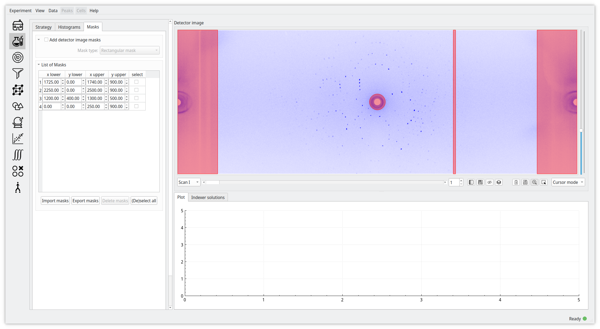

   Masking the detector images

The most important peak finder parameter is the threshold, which determines the
minimum number of counts for a pixel to be in a peak region; in this case, the
value (80) is appropriate, although if our detector image had too few peaks to
generate a convincing shape model, we might want to decrease these. The danger in
doing this is, of course, that including very weak peaks will degrade the
quality of our shape model later on. ``Minimum size`` and ``maximum size``
specify the minimum and maximum number of counts in a blob (i.e. a peak in real
space); the latter is important because a blob with too many counts might be a
heterogeneous background feature. Finally ``maximum width`` defines the maximum
number of frames over which a blob can extend. Leaving these parameters at their
current values, click on ``Find peaks``, and wait for the processing to finish
(this may take a few minutes).

.. _finder_params:
.. figure:: images/tutorial/finder_params.png
   :alt: Peak finder parameters
   :name: fig:finder_params
   :width: 75.0%

   Peak finder parameters

When the peak finding algorithm has finished, we should have identified 9851
peaks (this may vary slightly due to numerical imprecision and masking). At this
point, we need to integrate the peaks. The default integration apraeters are a
good guess for most situations. The shape of a blob can be characterised by an
covariance (or inertia) matrix, and we simply rescale this matrix to determine
the integration region. 3 is a good guess for the extent of the peak region
(``peak end``) because we expect to find 99.54\% of all counts within three
standard deviations of the peak centre. After clicking on the ``integrate``
button and waiting, the intensity, :math:`\sigma` and strength columns in the
table of peaks will be populated. Note that we don't want to make ``peak end``
too large, since we want to avoid overlapping intensity regions. The extent of
the background region is less critical, since overlaps will not affect the
results; however we want it to be large enough to get good statistics.

.. _found_peaks:
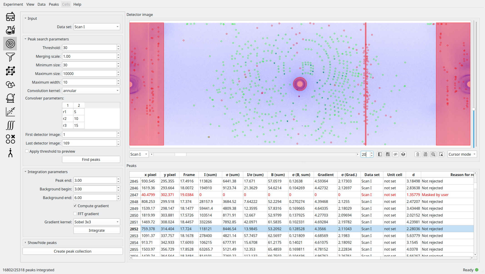

   After peak finding and integration

Note that after integration some peaks are marked as invalid; specifically, 8219
out of 9851 peaks are valid. We can check the ``reason for rejection`` column in
the table to see why they were rejected. In the first few frames and last few
frames of the data set, the reason is usually because the peak extends outside
the sample rotation range and is therefore incomplete. Also note how peaks close
to the rotation axis are often rejected, since they intersect the Ewald sphere
on many images, and frequently extend outside the sample rotation range as a
result. In any case, we have a good number of peaks, which we can use to both
determine the unit cell and generate a good shape model. Finally, click on
``create peak collection`` and name the collection ``found``.

.. _index:

Autoindexing
------------

We now need to determine the unit cell, or to be precise, the rotation matrix of
the unit cell, since the unit cell is generally known at this stage. Click on
the ``Autoindex`` icon on the sidebar.

.. _set_beam:

   Widget to adjust the direct beam position

It is absolutely critical that the direct beam position is accurate to within a
pixel or two at this point; if this is not the case, indexing will be very
difficult, if not impossible. Click on the ``set initial direct beam position``
checkbox; this will allow you to drag and drop a crosshair, the size of which
can be adjusted, on the detector image. The direct beam is by default at the
exact centre of the image, but the air scattering halo in this data set is a
better indicator of the "real" direct beam position. Adjust the crosshair size
so that it can be used as a guide centre the direct beam, and reposition it as
well as possible.

.. _indexed:
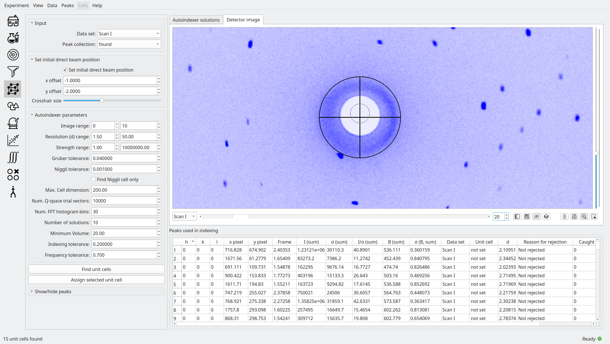

   Masking the detector images

Here, the direct beam position has been moved by about one and a half pixels in
the *x* and *y* directions, but even this tiny change has made a precipitous
improvement in the ease with which we can index this data set (try it without
setting the crosshair!).

.. _indexer_params:
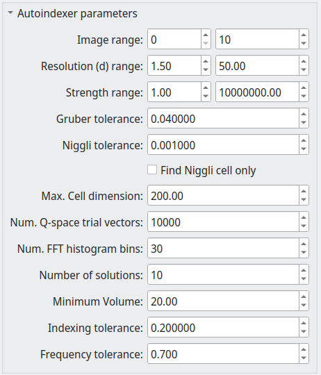

   Autoindexer parameters

Since we've done the most important task of correcting the direct beam position,
we don't need to adjust the indexer parameters too much. We only use peaks from
frames 0 to 10 to determine the cell (in fact, it is possible to do it with only
one frame in general, but we need to specify a range, since OpenHKL generates a
full 3D model). Adjusting ``strength`` and ``d range`` allows us to exclude weak
and high resolution peaks that may hinder the indexing algorithm. The indexer
generates a number of q-vectors over the unit sphere as candidate reciprocal
basis vectors; the number of vectors is specified by ``Q vertices`` (10 000 is
more than enough). For more problematic unit cells, it may be necessary to
change ``Subdivisions``, which controls the number of histogram bins used in the
Fourier transform algorithm. Click on ``Find unit cells``, then switch from the
``detector`` tab to the ``solutions`` tab.

.. _solutions:

   Candidate unit cells

A list of candidate unit cells is shown. If you were careful when adjusting the
direct beam, it should be quite easy to find the correct unit cell. In this
case, the cell parameters are ``54.97 58.53 67.58 90 90 90``. The space group in
this case is :math:`P2_12_12_1`, which corresponds body-centred orthorhombic
Bravais lattice (`oP` in the table). Again, the ability to find the correct
Bravais lattice and centring is crucial, and strongly dependent on the direct
beam position. In the screen shot, we can see that the hightlighted solution has
a quality of 100\%, meaning that 100\% of peaks in this collection can be
indexed using this unit cell. Select the best solution and click ``assign
selected unit cell`` to open the following dialogue.

.. _assign_cell:
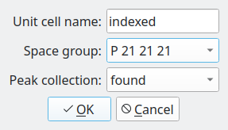

   Assign the selected unit cell to the ``found`` peak collection

This allows us to assign the chosen cell (``indexed``) to the peak collection we
generated from the image analysis step above.

.. _shape_model:

Shape model
-----------

Before generating an exhaustive set of predicted peaks, we need to construct a
preliminary shape model. We're not too interested in optimising the model at this
stage, but want to be sure that the predicted peak shapes are reasonable so
that it's possible to refine them. The most important parameter at this stage is
``minimum I/sigma``, excluding weak peaks from the model. Set this to 5.0, then
click ``build shape model`` and wait for the integration to complete. Click on
``save shape model`` and save the model.

.. _shape_params:
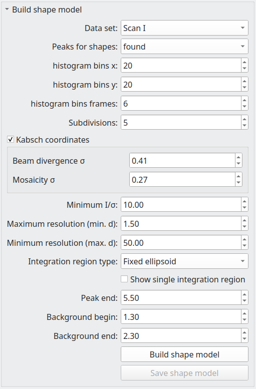

   Shape model parameters

A shape generated at specific detector coordinates can be previewed using the
shape preview widget. Here I have chosen the coordinates of a strong peak at
coordinates ``(1452, 359, 97)``, and compute a mean shape within a radius of 500
pixels and 10 frames.

.. _shape_preview:
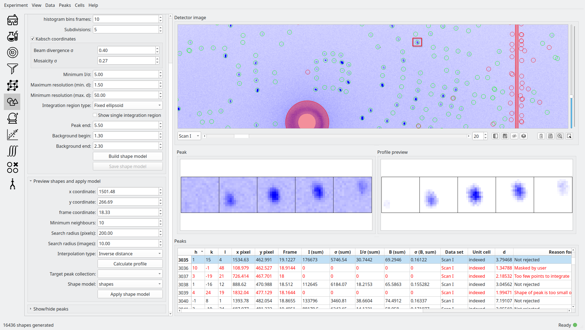

   Shape preview parameters

Note that the shape in the preview does not look much like the shape of the
strong peak at highlighted on the detector image. This is because the covariance
matrix has been interpolated on a square (20 x 20) grid, whereas most
peaks will have a rectangular bounding box, resulting in elliptical peak shapes.

.. _preliminary_shapes:
.. figure:: images/tutorial/preliminary_shapes.png
   :alt: On generating the preliminary shape model
   :name: fig:preliminary_shapes
   :width: 100.0%

   On generating the preliminary shape model

.. _predict:

Predict peaks
-------------

Click the ``predict`` icon on the sidebar. In this section we will use the unit
cell we found in the autoindexing step to predict an exhaustive set of peaks
within a given resolution cutoff. However, now that we have a unit cell we can
automatically refine the direct beam position. Set the number of batches to 30;
this will divide the ``found`` peaks into 30 batches with equal number of peaks,
contiguous in sample rotation angle. This means after refinement, we will have
30 different values for the direct beam position, varying as a function of
rotation angle.

.. _refine_beam:
.. figure:: images/tutorial/refine_beam.png
   :alt: Candidate unit cells
   :name: fig:refine_beam
   :width: 75.0%

   Candidate unit cells

Set the value of ``d min`` to 1.5 Å. peaks will be predicted up to this maximum
resolution. Click the ``predict`` button, and wait for the prediction to finish.

.. _predicted:
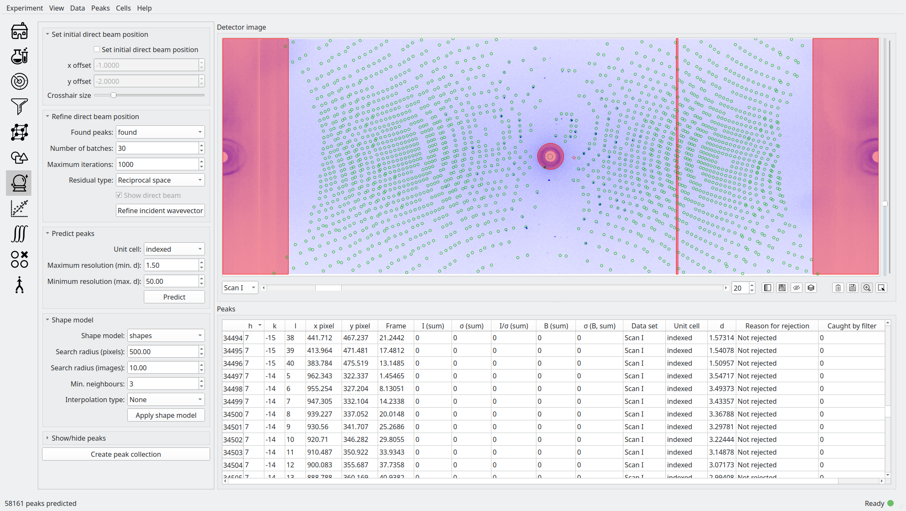

   Predicted peaks

Up to a resolution of 1.5 Å, we have 58229 predicted peaks, and it can be seen
in the screenshot below that the agreement for the peak centre positions is
quite good, if not perfect, and that it is worse at higher resolution. Now we
can apply our preliminary shape model to the predicted peaks by clicking
``apply shape model``.
We're not too concerned with the parameters at this point so
we'll just use the defaults. Looking at a section of the detector image before
and after applying the shape model, we can see that the peaks correspond to the
image significantly better afterwards.

.. _predicted_before_shapes:

   Predicted peaks before applying shape model

.. _predicted_after_shapes:

   Predicted peaks after applying shape model

This is because when the shape of a peak changes, the ellipse formed at the
intersection of the ellipsoid and the detector plane changes, and therefore the
centre of the detector spot on the detector image changes, and serves to
highlight the importance of the peak shape even at this stage in the data
reduction. Finally, click ``create peak collection`` and save the predicted
peaks as ``predicted``.

.. _refine:

Refine
------

At this point, we need to ensure that our predicted peaks coincide with the
spots on the detector images, to ensure that the integration is accurate. This
can be achieved by refining the unit cell and instrument parameters (namely the
incident wavevector, the detector position and the sample position and
orientation). Click the ``Refine`` icon on the sidebar.

Here, we will use a non-linear least squares algorithm to minimise the
difference between Miller indices of the predicted peaks and the *non-integer*
Miller indices of the peaks found via the image analysis step, by allowing the
unit cell and aforementioned instrument parameters to vary.

.. _refine_params:
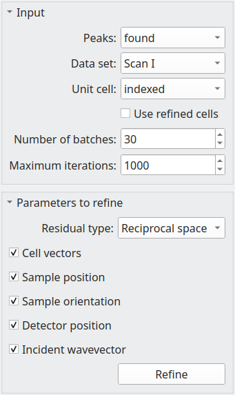

   Refinement parameters

The most important refinement parameter is ``number of batches``. Since the
instrument parameters and unit cell may change over the course of an experiment
due to thermal fluctuations, physical imperfections etc., it is likely that
these parameters will vary from frame to frame. To mitigate such errors, we
perform the refinement in batches, that is to say, we divide a peak collection
into *n* batches of equal numbers of peaks, and assign the peaks within that
rotation range the unit cell and instrument parameters from that batch. There
are 169 images in this data set, so we will divide the experiment into 30
batches, resulting approximately 5 images per batch (although this will vary,
since the peaks are not evenly distributed over the rotation range). Note also
that there is an "overlap" region between batches, such that the batch 2, for
example, will contain some peaks from batch 1.

We start with the unit cell found in the :ref:`index` section. The ``use refined
cells`` checkbox indicates, when checked, that the refiner will use the *batch*
unit cells instead of the single unit cell indicated in the ``unit cell`` box as
the starting point (it should be unchecked for the moment). For this data set,
the optimisation is relatively straightforward, so we can refine all parameters
simultaneously, so all check boxes under ``parameters to refine`` should be
checked. Now click ``refine``. This will adjust the instrument parameters and
unit cells, but we will need to update the predicted unit cells to see what
physical effect this has. In case we want to compare the predicted peaks before
and after refinement later on, let's clone the predicted peaks. From the menu,
select ``peaks > clone peak collection`` and in the resulting dialogue, clone
the ``predicted`` peak collection to a new collection to be named ``refined``.
From the ``update predictions`` section in the controls, select the new
collection ``refined`` in the ``predicted peaks`` box, then click on ``Update``.
After waiting a couple of minutes, you should be able to see something like the
following under the ``detector`` tab.

.. _refine1:
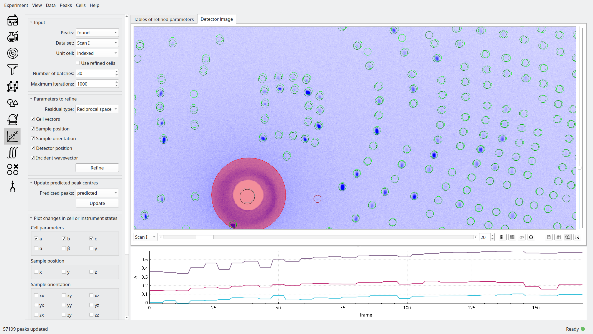

   Predicted peaks pre- (dark green) and post-refinement (light green)

The change should be quite significant. You can see how the unit cells and
instrument parameters change numerically as a function of rotation angle under
the ``tables`` tab. We can try refining again, using the newly created "batch"
unit cells as a starting point by clicking the ``use refined cells`` checkbox,
then clicking ``refine`` again, followed by ``update``. From the screenshot
below, we can see not much has changed, but there are a few higher resolution
peaks that have moved significantly.

.. _refine2:
.. figure:: images/tutorial/refine2.png
   :alt: Predicted peaks pre- and post-refinement, second run
   :name: fig:refine2
   :width: 100.0%

   Predicted peaks pre- and post-refinement, second run

This is good enough for now, but later on we might want to run the refiner again
when we've applied a better shape model.

.. _integrate:

Integrate
---------

Now that we have a decent agreement between the positions of our predicted peaks
and detector spots, we can compute the intensities and variances of the
predicted peaks by clicking on the ``integrate`` icon on the sidebar.

First though, it would be helpful to visualise the integration region, so we can
check that they are sane, and we don't have too many overlaps between adjacent
peak regions. Expand the ``show/hide peaks`` section in the controls, and check
the ``integration regions`` checkbox.

.. _integration_regions:
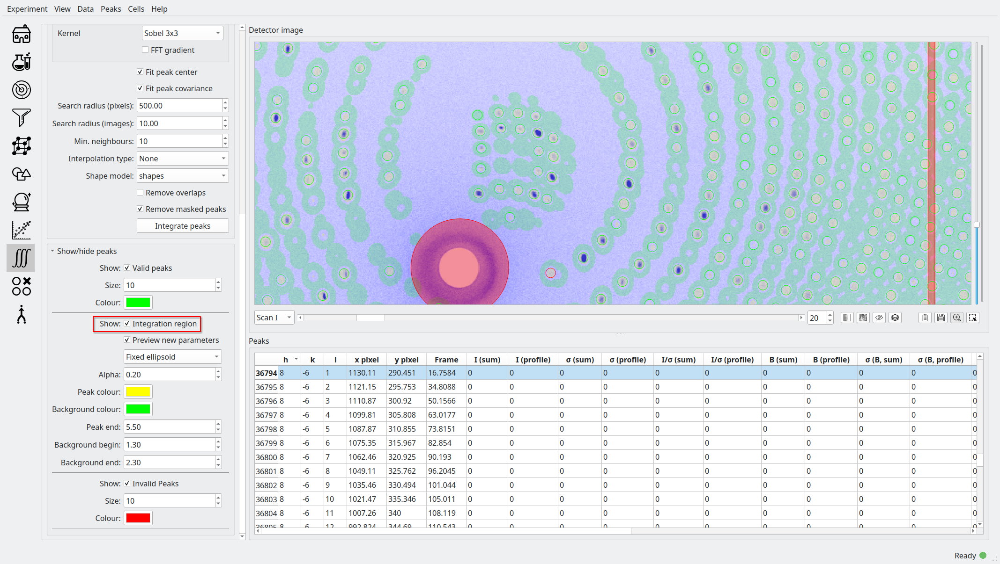

   Integration regions of predicted peaks

The integration regions look good to the naked eye here, in general. The
detector spots are in general almost exactly coincident with the peak regions of
the predicted peaks, and there are no overlaps. If there were overlaps, we could
try decreasing the size of the peak regions. In fact, we can visualise the
effect of changing the integration region limits without changing their actual
values by checking the ``preview integration region`` box, then adjusting the
three values below. Note in the screenshot the presence of at least one detector
spot (in the red box) that does not coincide as well as the others with the
integration region of its associated predicted peaks. Although it is off-centre,
it still looks as though the peak intensity is contained within the yellow
region. To check we can visualise the integration region for this peak one all
of the images on which it appears by double-clicking on it in the detector
image.

.. _bad_shape:
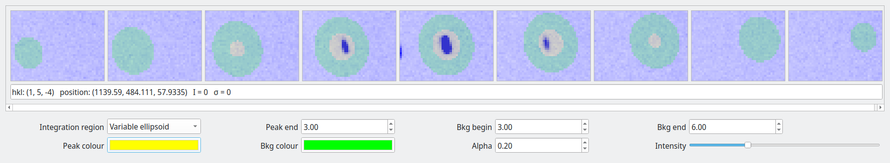

   Visualising the suspicious peak on its own

The detector spot is well-centred in the middle image, but is less so on
adjacent images. This is evidence of a poor shape model: the major axis of the
ellipsoid we generated earlier is skewed with respect to the blob formed by the
detector spots. This is not a problem for integration of this specific
reflection, but may be indicative of a systematic problem with affects peaks in
high resolution areas of the detector image. For now, however, we will proceed
with the integration.

The crucial parameters for integration are the integration region bounds (``peak
end``, ``background begin`` and ``background end``), but we have established
that the current values (3, 3, 6) are good enough for the moment. Click on the
``remove overlaps`` checkbox, and observe which peaks are deselected.

.. _overlaps:
.. figure:: images/tutorial/overlaps.png
   :alt: Peaks removed due to overlaps
   :name: fig:overlaps
   :width: 100.0%

   Peaks removed due to overlaps

In the screenshot above, we can see two instances (red boxes) where peaks were
invalidated due to overlaps. At the bottom of the detector image there is a
clear clash, but at the top it is less obvious; the peak is removed because it
intersects with another one at a different rotation angle (i.e. on a different
image). Note that both of these overlaps occur close to the sample rotation
axis. This is to be expected, since such peaks tend to intersect the Ewald
sphere over a very large rotation angle; they have large variances and appear on
many frames, and are thus more likely to clash. In this instance, however, we
have an acceptable number of overlaps, so we can integrate the peaks by clicking
``integrate peaks``.

.. _integrated:
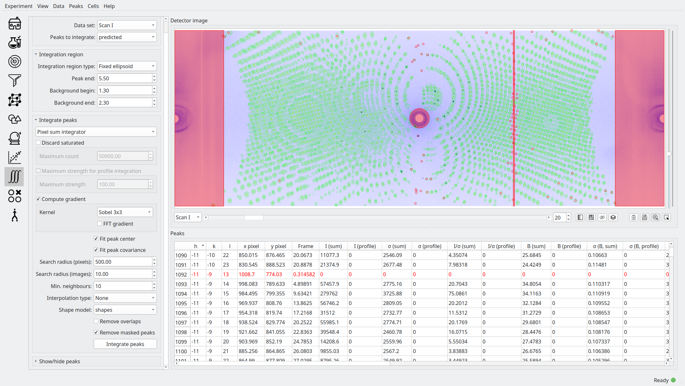

   Post-integration screen

Now the ``intensity`` and ``sigma`` columns in the table have been populated,
and we can see that 54298/58229 peaks were successfully integrated,
approximately 93\%. For the purposes of this tutorial, this is acceptable, but
could be improved. Now we can merge the predicted peaks and get an idea of the
quality of the integration.

.. _merge:

Merge
-----

Merging peaks that are related by space group symmetry operations gives us a
measure of the quality of the data reduction. These symmetry-related peaks
should have identical intensities, and the R-factors and CC-values computed in
the ``Merge`` section give a statistical measure of the extent to which this is
true.

The reciprocal space in the resolution range 1.5 Å to 50 Å (in this instance) is
divided into 10 concentric shells of equal reciprocal space volume, and the
quality metrics computed for each individual shell, and for the overall volume.
We also have the option of omitting the frames at the beginning and end of the
rotation range, since the peaks here cannot generally be interpolated or are
incomplete; however this is not usually necessary since such peaks are flagged
as invalid.

.. _merge:
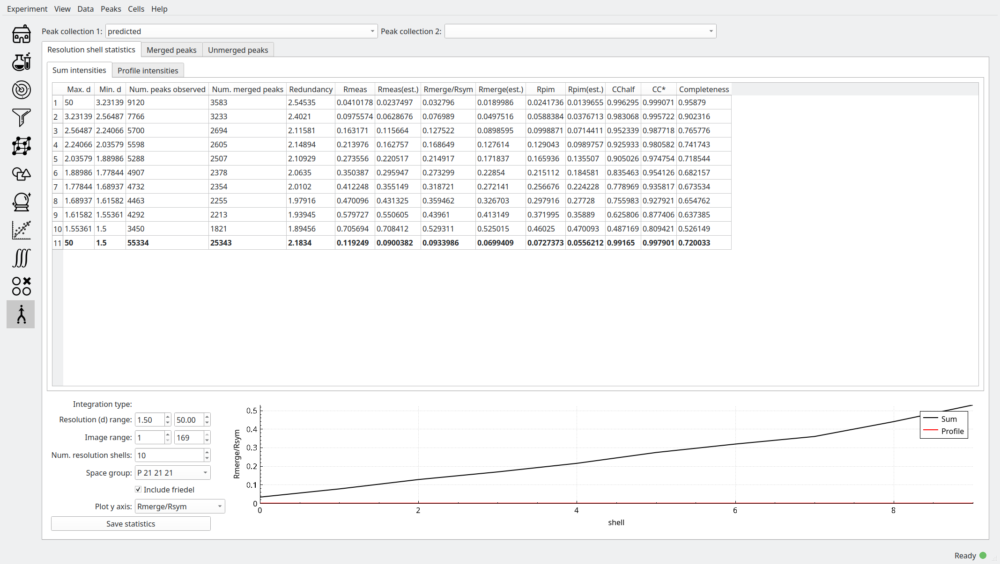

   Resolution shell statistics

There are many different quality metrics, but for this tutorial, we will just
look at :math:`R_\mathrm{pim}`. It is close to zero at low resolutions (0.022
between 3.23 and 50.0 Å), and monotonically increases as the resolution
increases, up to 0.5 in the 1.5 to 1.55 Å regime.

.. _merged_peaks:
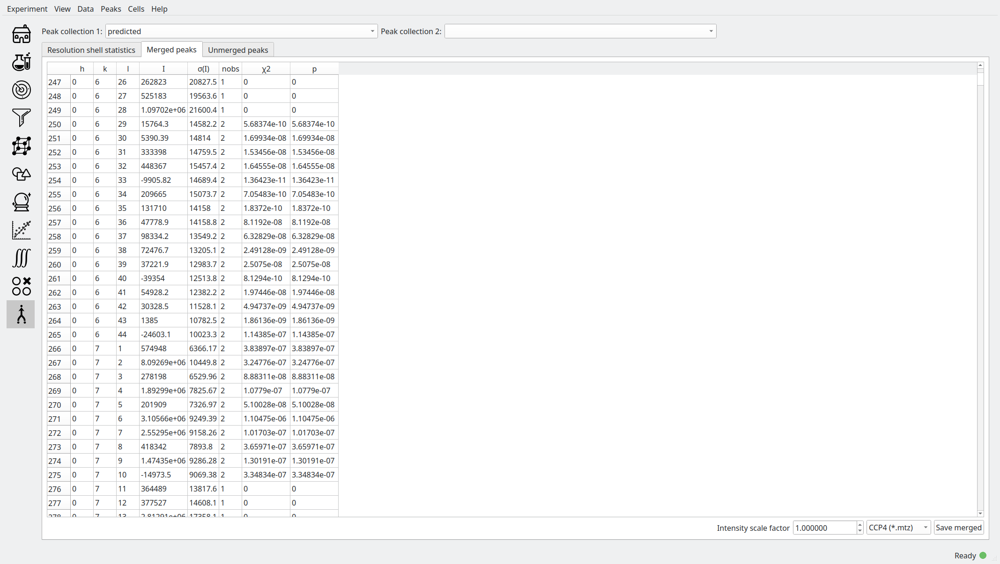

   Table of merged peaks

.. _unmerged_peaks:

   Table of unmerged peaks

Finally, we can inspect the lists of merged and unmerged peaks by clicking on
their respective tabs. The unmerged peak table is the essential goal of the data
reduction process, and can be exported in various different formats to use in
refinement of structural models; it is simply a list of peaks with their Miller
indices, coordinates, intensities and sigmas. The merged peaks tab gives the
redundancy, the number of symmetry-equivalent peaks for a given index, together
with a "goodness of fit" parameter in the form of a :math:`\chi^2` value.

Further work
------------

We can attempt to improve the quality of the data reduction, but this is left as
an exercise for the reader. Here are some hints:

1. **Improve the shape model**. In the first instance, we used peaks found in
   the image analysis step to generate a model. Since we have a lot of peaks in
   this model, perhaps we could achieve better fits by using only stronger
   peaks, by increasing the minimum strength. When the shape model is applied to
   a collection of predicted peaks, the highest resolution predicted peaks (at
   around 1.5 Å in this case) are invalid because there are not enough
   neighbouring "found" peaks (i.e. strong detector spots) to generate a
   reliable mean shape. One way of dealing with this is to increase the neighbour
   search radius (``radius`` for pixel radius and ``frames`` for angular radius
   in the ``shape model`` controls); however, the risk is that we include peaks
   from too far away are qualitatively different to local peaks. We can overcome
   this by using different shape interpolation schemes (``interpolation type``):
   "inverse distance" gives peaks closer to the selected peak a higher weight
   when averaging, and "intensity" gives stronger peaks a higher weight.
   Finally, we can try to "bootstrap" our calculation by using the shapes of the
   predicted peaks to generate a new shape model.

2. **Better refinement**. It may be possible to optimise the number of batches
   used in the refinement. Additionally, it is possible that refining all
   parameters simultaneously might trap the algorithm in a local minimum. This
   can be avoided by optimising parameters individually, or using an alternative
   residual. Finally, if the shape model changes, then the per-image peak
   centres will also change, so it will be necessary to perform the refinement
   process again.

3. **Better integration**. So far, we have used the most naive integration
   technique, pixel sum integration. This is simply a sum of the peak intensity
   pixels with the local background subtracted. It is possible to achieve better
   results using a profile integration technique, which averages in the shapes
   of surrounding peaks. Results might also be improved with a better choice of
   integration region. One possibility is modifying the bounds of the integration
   region (``peak end``, ``background begin`` and ``background end``) to ensure
   that even in cases where the predicted peak is slightly off
   centre, all of the peak intensity pixels are encompassed by the integration
   region. It may also be possible to improve the results using a "fixed
   ellipsoid" as the ``integration region type``. In this case, an ellipsoid
   with the same *r2* metric (notionally radius) is used to construct the
   integration region for all peaks, regardless of their location on the
   detector. This is in general better than having an integration region whose
   size varies with :math:`\sigma` as in the case of the "variable ellipsoid"
   integration region.

.. bibliography:: references.bib
    :cited:
    :labelprefix: T
    :keyprefix: t-
    :style: unsrt
