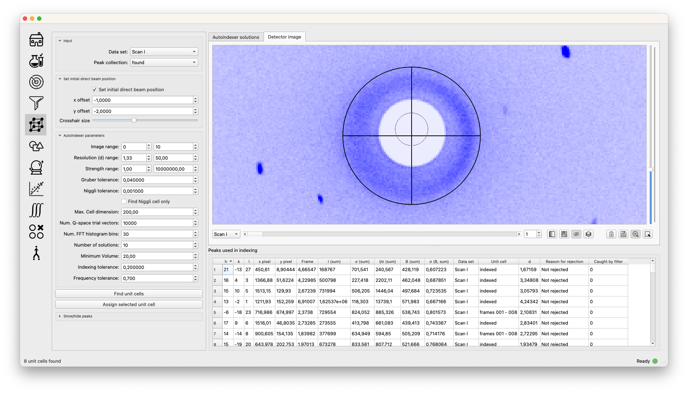
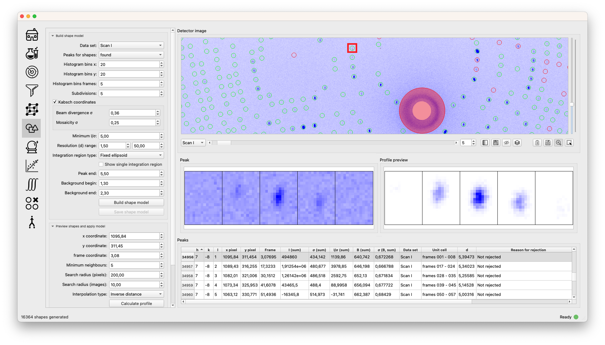
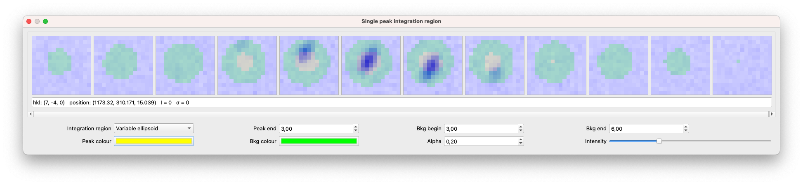
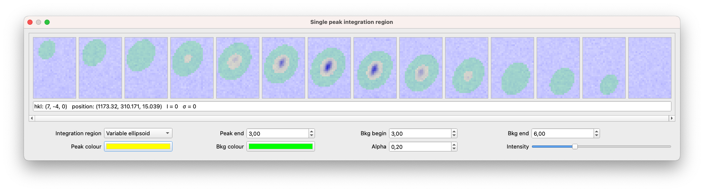
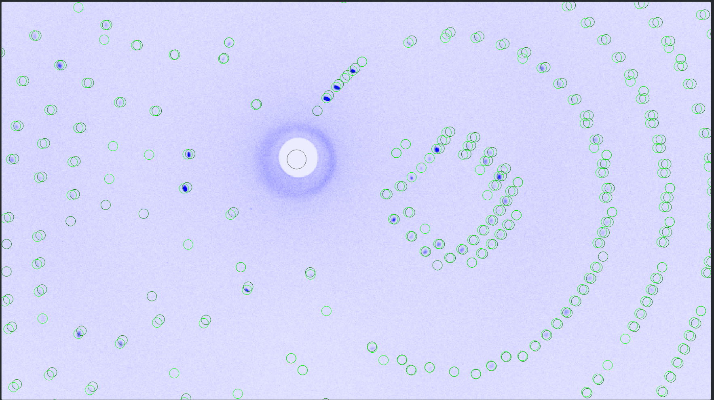
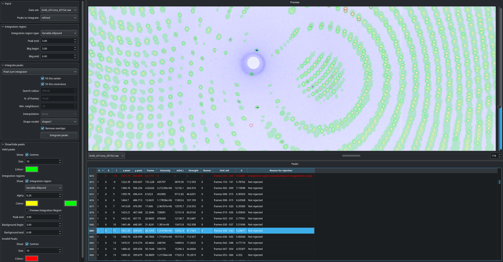
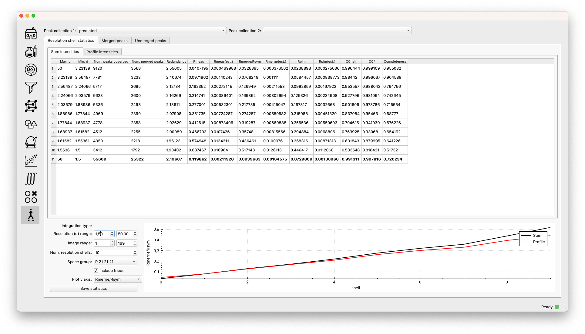

.. _workflow:

Workflow
========

The workflow in OpenHKL approximately follows the order of the icons in
the sidebar: find peaks, filter, autoindex, predict, refine, merge. The
``Home`` tab enables experiment creation and loading/saving, while
the ``Experiment`` tab allows inspection and editing of various aspects
of the physical experiment.

The virtual “experiment” is the highest level object, and contains all
information from the physical experiment (the data sets), plus any
derived/reduced data, such as the unit cell, peaks, indices, and merged
data statistics. This object can be saved at any stage in the workflow
by returning to the ``Home`` tab.

Home
----

The home tab shows a list of loaded experiments, and allows creation of
new experiments, the loading of a saved experiment state and saving an
existing experiment state.

-  ``Create new experiment`` opens a dialogue prompting the user to name
   the experiment and select the instrument used. The parameters
   specific to that instrument are loaded from a YAML-formatted
   instrument file found with the source code.

-  ``Load from file`` loads a ``hdf5`` file containing a *saved*
   experiment state.

-  ``Save current`` saves the current experiment state as a ``hdf5``
   file.

-  ``Save all`` saves all experiments in ``hdf5`` format.

There are three tables summarising the state of the experiment on the left hand
side of this window.

.. list-table:: Data sets
   :widths: 20, 10, 20
   :header-rows: 1
   :align: left

   * - Column
     - Unit
     - Description
   * - Name
     -
     - Name of the data set
   * - Diffractometer
     -
     - Name of diffractometer used
   * - Number of frames
     -
     - Number of images in this data set
   * - Number of rows
     - pixels
     - Height of image
   * - Number of columns
     - pixels
     - Width of image

.. list-table:: Peak collections
   :widths: 20, 10, 20
   :header-rows: 1
   :align: left

   * - Column
     - Unit
     - Description
   * - Name
     -
     - Name of the peak collection
   * - Number of peaks
     -
     - Number of peaks in this collection
   * - Number of invalid
     -
     - Number of rejected peaks in this collection
   * - Is indexed
     - Y/N
     - Peaks in this collection have Miller indices
   * - Is integrated
     - Y/N
     - Peaks in this collection have calculated intensities
   * - Type
     -
     - Labels peak collection as ``found`` or ``predicted``

.. list-table:: Unit cells
   :widths: 10, 10, 20
   :header-rows: 1
   :align: left

   * - Column
     - Unit
     - Description
   * - ID
     -
     - Integer label of unit cell
   * - Name
     -
     - Name of Unit Cell
   * - Space group
     -
     - Assigned space group of unit cell
   * - :math:`a`
     - Å
     - :math:`a` cell parameter
   * - :math:`b`
     - Å
     - :math:`b` cell parameter
   * - :math:`c`
     - Å
     - :math:`c` cell parameter
   * - :math:`\alpha`
     - degrees
     - :math:`\alpha` cell angle
   * - :math:`\beta`
     - degrees
     - :math:`\beta` cell angle
   * - :math:`\gamma`
     - degrees
     - :math:`\gamma` cell angle

Sets of detector images taken at different sample rotation angles can be added to the experiment either via the ``Data`` menu or by clicking the "add data set" icon on the home panel. Image data sets can take the form of ``.tiff`` images, ``.raw`` images or Nexus data sets. After selecting the appropriate option to load data files, the user is prompted to select files, and then in the case of raw and tiff data, enter some metadata parameters via the raw/tiff data loader dialogue.

.. list-table:: Tiff and raw data loader parameters
   :widths: 20, 10, 20
   :header-rows: 1
   :align: left

   * - Parameter
     - Unit
     - Description
   * - Data arrangement
     - Row/column major
     - Whether rows or columns are contiguous in memory
   * - Data format
     - 16/32 bit integer/float
     - Bit depth and type of pixel value
   * - Swap endian
     - T/F
     - Swap endianness of data (big/little)
   * - Image resolution
     - pixels
     - Select image resolution, columns x rows (Raw only)
   * - Rebinning
     - pixels
     - Downscale image by given ratio (Tiff only)
   * - :math:`\Delta\chi`
     - degrees
     - :math:`\chi` angular stepping for sample
   * - :math:`\Delta\omega`
     - degrees
     - :math:`\omega` angular stepping for sample
   * - :math:`\Delta\phi`
     - degrees
     - :math:`\phi` angular stepping for sample
   * - wavelength
     - Å
     - wavelength of incident neutron beam
   * - Use baseline/gain
     - T/F
     - Use the baseline and gain specified for the detector
   * - baseline
     -
     - Value subtracted from each pixel before integration
   * - gain
     -
     - Value dividing each pixel before integration

Unlike raw images, tiff image files include a header containing most of the
required metadata, so only information on the experimental parameters will be
required. Nexus files contain all the necessary experimental metadata and has
no associated loading dialogue.

Experiment
----------

This panel contains three tabs with functionality that is normally required
before the data reduction process is started: ``strategy``, ``histograms`` and
``masks``.

There are three tabs on the left-hand panel: ``Strategy``, ``Histograms`` and
``Masks``.

Strategy
~~~~~~~~

The ``strategy`` tab contains controls for finding blobs (notionally
peaks) in a single image, using those blobs to determine the unit cell, and
predicting the completeness of the peaks given a sample rotation angle
increment. The ``Set initial direct beam position`` controls the point at which
the direct beam intersects the detector image. In the first instance, this is
assumed to be in the centre of the image, but this may be off by a few pixels.
Clicking the checkbox allows the user to drag a resizable crosshair in the
detector image panel, which will define the exact direct beam position. The ``x
offset`` and ``y offset`` controls define the offset of this crosshair, in pixels,
with respect to the *centre* of the image.

The ``Find blobs in this image`` box allows the user to leverage image processing
algorithms from the OpenCV (namely ``SimpleBlobDetector``) library to locate
detector spots.

.. list-table:: 2D blob finder parameters
   :widths: 20, 10, 20
   :header-rows: 1
   :align: left

   * - Parameter
     - Unit
     - Description
   * - Convolution kernel
     -
     - Matrix for image filtering
   * - Filtered image threshold
     - pixel counts
     - Pixels with value below threshold are discarded
   * - Minimum blob threshold
     - pixel counts
     - Blob is discarded if it contains fewer points than this
   * - Maximum blob threshold
     - pixel counts
     - Blob is discarded if it contains more points than this
   * - Search all images
     -
     - FInd spots in all images in data set
   * - Apply threshold to preview
     -
     - Show the filtered and threshold image

The autoindexer parameters are described in :ref:`sec_autoindexing`, but it
should be noted that indexing from a single image generally requires masking of
``difficult'' regions of the detector such as the beam stop, and a good initial
guess for the direct beam position.

.. list-table:: Strategy peak prediction
   :widths: 20, 10, 20
   :header-rows: 1
   :align: left

   * - Parameter
     - Unit
     - Description
   * - :math:`\Delta\chi`
     - degrees
     - Angle increment for sample rotation about :math:`\chi` axis
   * - :math:`\Delta\omega`
     - degrees
     - Angle increment for sample rotation about :math:`\omega` axis
   * - :math:`\Delta\phi`
     - degrees
     - Angle increment for sample rotation about :math:`\phi` axis
   * - Number of increments
     -
     - Sample rotation increments or images to simulate
   * - d range
     - Å
     - Resolution range for predicting peaks

Histograms
~~~~~~~~~~

The ``Histograms`` tab allows the user to plot histograms of *pixel* statistics
(as opposed to peak statistics).

The ``Per-pixel detector count histograme`` allows the user to plota histogram of
pixel counts for either the current single image, or for all images (by checking
the ``All images`` box. Checking the ``Plot intensity profiles`` box changes the
interaction mode in the detector image to draw a ("Line plot", "Horizontal
slice" or "Vertical slice") through the image, and plot a histogram of the
intensity along that line with the given number of bins.

Masks
~~~~~

The ``Masks`` tab allows the user to add masks to the data set. A mask is
either an ellipse or a rectangle present on *all images in the data set*, on
which detected spots or peaks and integration is not valid. Possible reasons
to add a mask can be to prevent peak finding on a the beam spot, or to
prevent integration of peaks on heterogeneous features such as seams between
detector plates. The ``Add detector image masks`` check box changes the
interaction mode in the detector image to draw a mask by dragging and
dropping, the shape of which is specified in the list (rectangular or
elliptical). Masks are displayed in the list below, and the extents of the
masks can be fine tuned.

The screenshot above demostrates masking the detector image to exclude invalid
regions from the peak search. The beam stop and the seam between detector plates
(thin white line in this context) have been masked using the masking tool in the
bottom right hand corner, such that any peaks found in these regions will be
rejected. The region around the beam stop containing the air scattering halo has
also been masked because the heterogeneous background will result in poor
integration.

Find peaks
----------

The initial peak search is essentially a pure image processing step,
with no crystallographic input. The technique is roughly as follows

#. Apply an image filter to subtract local background

#. Apply a threshold to the resulting image

#. Find connected components (“blobs”) of the resulting thresholded
   image

#. Merge blobs that overlap, according to some cutoff

In the first step, we apply a filter which consists of a central
circular region with positive weight, and an outer annular region with
negative weight. The weights are chosen so that the convolution computes
the local average of the circular region subtracted by the average of
the annular region, effectively giving a local background subtraction.
The radii of the circle and annulus may be specified by the user.

To find connected components, we use a standard `blob detection
<https://en.wikipedia.org/wiki/Blob_detection>`_ algorithm. In the last step,
we compute inertia ellipsoids for each blob, and merge those blobs whose
ellipsoids overlap, after a user-defined scaling factor has been applied. The
merging process is repeated until there are no longer any overlapping
ellipsoids.

The collision detection problem for ellipsoids is sped up by storing
them in an octree.

.. list-table:: Peak finder parameters
   :widths: 20, 10, 20
   :header-rows: 1
   :align: left

   * - Parameter
     - Unit
     - Description
   * - Threshold
     - pixel counts
     - During peak finding, pixels above this value are set to 1, otherwise 0
       after filtering
   * - Merging scale
     - :math:`\sigma`
     - Scale factor for covariance matrix to detect collisions between blobs
   * - Blob size range
     - pixel counts
     - Only blobs with counts in this range will be kept
   * - Maximum width
     - frames
     - Only blobs spanning fewer images than this number will be kept
   * - Convolution kernel
     -
     - Type of convolution matrix to use in image filtering
   * - Parameters
     -
     - Radius parameters used in construction of convolution matrix
   * - Frame range
     - frames
     - Find peaks in this image range
   * - Apply threshold to preview
     -
     - Switch detector image to filtered and thresholded view

At this stage in the workflow, there are no available profiles to perform
profile integration. The found peaks are integrated at this stage using
:ref:`sec_pixelsum`, a simple summation of peak pixel counts with a mean
background subtraction.

The following three integration parameters are explained in detail in
:ref:`sec_peakshape` . Briefly, however, they are scaling factors that determine
the size of the ellipsoids representing the peak and background region. The
covariance matrix is scaled by a dimensionless :math:`\sigma^2`, such that an
ellipsoid scaled by a "peak end" of :math:`\sigma` contains 66.3% of points in
the ellipsoid, 95.4% for :math:`2\sigma` and 99.7% for :math:`3\sigma`. The
ellipsoids (projected to ellipses on the detector scene) can be visualised via
the "Show/hide" peaks widget.

.. list-table:: Integration parameters
   :widths: 20, 10, 20
   :header-rows: 1
   :align: left

   * - Parameter
     - Unit
     - Description
   * - Peak end
     - :math:`\sigma`
     - End of peak region in multiples of the blob covariance matrix
   * - Background begin
     - :math:`\sigma`
     - Beginning of background region in multiples of the blob covariance matrix
   * - Background end
     - :math:`\sigma`
     - End of background region in multiples of the blob covariance matrix
   * - Compute gradient
     -
     - Whether to compute the image gradient
   * - FFT gradient
     -
     - Whether to use Fast Fourier Transform to compute gradient
   * - Gradient kernel
     -
     - Matrix kernel to use for gradient convolution

Filter peaks
------------

The filter peaks tab allows the user to remove peaks that meet certain
criteria froma collection and save this subset as a new collection. The
following controls cause the filter to catch that have:

State
   a specific (hidden) state flag set to “true”

   -  Selected — unselected peaks are generally unfit for integration
      for some reason

   -  Masked — a peak is masked if it has been manually highlighted on
      on the detector view

   -  Predicted — the peak has been predicted as opposed to found via
      the peak search algorithm

   -  Indexed — the peak has a unit cell assigned

Indexed peak
   been indexed (i.e. have a unit cell assigned)

Strength
   a strength (:math:`I/\sigma`) in the specified range

d range
   a d value (Å) in the specified range

Frame range
   a frame value (i.e. image number) in the specified range

Overlapping
   Remove pairs of peaks for which the intensity region ("peak end") overlaps an
   adjacent background region ("background end"). Set these to the same value to
   remove only overlapping intensity regions.

Rejection reason
   Remove all peaks other than those which the selected rejection reason.

Sparse dataset
   Remove peaks from data sets which contain too few peaks.

Merged peak significance
   Reject peaks which fail a chi squared test. If the probability of a peak
   having an intensity less than the chi squared of the intensities of the
   merged peaks of which it is a member is less than the expected variance, it
   is rejected.

Extinct from spacegroup
   Reject peaks that are forbidden by space group symmetry considerations. See
   :ref:`peaktable` for a detailed list of options, with explanations.

Note that the peak table contains an extra column on this widget, ``caught by
filter``. This allows the user to sort peaks caught by the filter to the top of
the peak table with a single click.

.. _sec_autoindexing:

Autoindexing
------------

The unit cell is determined in this tab using the 1D Fourier transform
method :cite:`w-Steller1997`, and peaks are assigned Miller
indices. A unit cell is **required** for all subsequent sections of the
workflow.

The algorithm works as follows. We are given some set of
:math:`\mathbf{q}` vectors which lie approximately on a lattice, yet to
be determined. To find candidate lattice directions, we take a random
sample of directions using the Fibonacci sphere algorithm. For each direction,
we perform the orthogonal projection of each :math:`\mathbf{q}` vector to the
infinite line specified by the direction. We then take a finite number of bins
along this line (the way the binning is performed can be controlled by
user-defined parameters), and then take FFT of the resulting histogram. The
histogram will be strongly periodic when the direction corresponds to a lattice
direction, so we identify lattice vectors by taking the strongest Fourier modes
of the histograms.

The FFT method produces a finite set of potential lattice vectors. To
find a basis, we enumerate over triples of these basis vectors and rank
them according to

#. The percentage of peaks that can be indexed (with integer indices)

#. The volume of the resulting unit cell

This provides a ranked list of candidate unit cells, from which the user
may choose.

.. list-table:: Autoindexing parameters
   :widths: 20, 10, 20
   :header-rows: 1
   :align: left

   * - Parameter
     - Unit
     - Description
   * - Image range
     - frames
     - Choose a limited (contiguous) subset of images over which to index
   * - Resolution (d) range
     - Å
     - Peaks with q-vector outside this range will not be used in indexing
   * - Strength range
     -
     - Peaks with strengths outside this range will not be used in indexing
   * - Gruber tolerance
     -
     -
   * - Niggli tolerance
     -
     -
   * - Find Niggli cell
     - T/F
     - Whether to find the Niggli primitive cell
   * - Max. cell dimension
     - Å
     - Maximum length of *any* cell vector
   * - Num. Q-space trial vectors
     -
     - Number of reciprocal space directions to search for lattice vector
   * - Num. FFT histogram bins
     -
     - Number of reciprocal space bins for Fourier transform
   * - Number of solutions
     -
     - Number of trial lattice vectors with which to construct triples
   * - Minimum volume
     - :math:`Å^3`
     - Minimum unit cell volume
   * - Indexing tolerance
     -
     - Maximum difference between floating point :math:`hkl` and integer
       :math:`hkl`
   * - Frequency tolerance
     - 0.0 - 1.0
     - Minimum fraction of amplitude of zeroth Fourier frequency to accept as
       candidate lattice vector

The FFT indexing method can be difficult to use correctly because there
is no systematic method for reaching the correct solution, and there are
many adjustable parameters. As a guide, the follwing tend to have a
substantial effect on the success (or otherwise) of the procedure:

#. Number of peaks/number of frames: using too many peaks/frames tends
   to result in failure. This is obviously strongly dependent on the
   nature of the sample. For example, using the BioDiff detector, up to
   10 frames, containing no more than 300 peaks seems to be sufficient
   to index complicated biological crystals.

#. Subdivisions: The process is strongly dependent on the number of FFT
   histogram bins.

#. Q Vertices: This is the parameter that is most easy to systematically
   vary, since more Q vectors will increase the likelihood of finding
   one that is parallel to the normal to a lattice plane. Increasing
   this value will usually (but not invariably) enhance the odds of
   finding a lattice vector.

#. Frequency Tol: the FFT algorithm will discard any candidate
   reciprocal lattice vector whose amplitude is less than this fraction
   of the zeroth Fourier frequency. Use with care!

The closest unit cell can then be selected as a row from the table of solutions
and assigned to a peak collection (usually the collection of *found* peaks. Note
that it is important to find the cell with the correct centering (Bravais type)
or the correct space group may not be visible in the list in the ``Assign unit
cell`` dialogue box. This may require additional experimentation with the
parameters.

In practice, the position of the direct beam is the parameter that usually
determines the success of this algorithm. In the first instance, OpenHKL will
assume that the direct beam position is at the exact centre of the detector
image, when it is in fact likely to be off by a few pixels, enough to prevent
the algorithm from finding a solution. At this stage, we have no unit cell, so
refinement is not an option, leaving the option of manually adjusting the direct
beam position. This can be done by checking the "set initial direct beam
position" box and dragging and dropping a crosshair in the detector scene. The
"x offset" and "y offset" boxes show the offset in pixels from the centre of the
image, and the "crosshair size" and "crosshair linewidth" controls offer a guide
to the eye when determining the

.. _directbeam:

An example of this procedure is shown above. The air scattering halo in this
instance can be used to give a better estimate of the direct beam position,
which is off by 2-3 pixels in each direction. This small adjustment is enough to
successfuly find the correct unit cell, orientation and Bravais lattice with the
default autoindexing parameters.

.. _sec_shape_model:

Shape model
-----------

The details of the shape model are explained in :ref:`sec_peakshape`, but for
the purposes of this section it is enough to know that each peak is modeled as
an ellipsoid extending over several frames (specifically over a finite sample
rotation angle). The shape model is intended to define the shape of peaks which
do not have strong intensity regions on the detector image, and whose shape
(covariance matrix) is unknown, even though the position of the centre of the
peak is known. A shape model is constructed by adding the shapes of *strong*
peaks from a peak collection to a "shape model"; this model can be used to predict
the shape of the peak with its centre at given coordinates by taking the mean of
the covariance matrix of the neighbouring peaks, within a cutoff.

The first set of parameters determines the shape model, and includes,

1. The size and shape of the histogram on which to construct the mean profile
2. The number of subdivisions per pixel to use when binning
3. The coordinate systems (Kabsch or detector)
4. The parameters used by the Kabsch coordinate system
5. Parameters to filter unwanted peaks from the model
6. Integration parameters for the shape model

The binning scheme for constructing the shape model is described in
:ref:`sec_least_squares`. Once the parameters are set, the shape model is
constructed by clicking ``Build shape model``. The shape model is used later,
in assigning shapes to predicted peaks and profile integration.

.. list-table:: Shape model parameters
   :widths: 20, 10, 20
   :header-rows: 1
   :align: left

   * - Parameter
     - Unit
     - Description
   * - Histogram bins x
     -
     - Number of bins to sample peak pixels in detector x direction
   * - Histogram bins y
     -
     - Number of bins to sample peak pixels in detector y direction
   * - Histogram bins frames
     -
     - Number of bins to sample peak pixels in detector frame (rotation) direction
   * - Subdivisions
     -
     - Number of sampling subdivisions along each axis, per pixel
   * - Kabsch coordinates
     - T/F
     - Use Kabsch coordinate system to undo effects of detector geometry on profiles
   * - Beam divergence :math:`\sigma`
     -
     - Peak variance due to beam divergence in Kabsch model (:math:`\sigma_D`)
   * - Mosaicity :math:`\sigma`
     -
     - Peak variance due to crystal mosaicity in Kabsch model (:math:`\sigma_M`)
   * - Minimum :math:`I/\sigma`
     -
     - Minimum strength of peak to use in shape model
   * - Resolution (d) range
     - Å
     - Only include peaks in this resolution range in the model
   * - Integration region type
     -
     - Switch between variable and fixed-size integration regions
   * - Show single integration region
     -
     - Display integration region of single clicked peak on detector image
   * - Peak end
     - :math:`\sigma`
     - End of peak region in multiples of the blob covariance matrix
   * - Background begin
     - :math:`\sigma`
     - Beginning of background region in multiples of the blob covariance matrix
   * - Background end
     - :math:`\sigma`
     - End of background region in multiples of the blob covariance matrix

The second set of parameters controls the preview images generated in the "Shape
preview" panel. These include the coordinates of the chosen peak (these can also
be set by clicking on a peak in the detector image), the minimum number of
neighbouring *strong* peaks in the given radius required to construct a sensible
shape, and two radii for neighbour searches, in the plane of the detector image
(in pixels) and perpendicular to the detector image (in frames). The weighting
scheme determines the weights used in averaging neighbouring strong peaks to
construct a profile: this can be set to "none" (a weight of 1), "inverse
distance" (peaks further from the reference peak have a smaller contribution)
and "intensity" (weaker peaks have a smaller contribution).

.. list-table:: Shape preview parameters
   :widths: 20, 10, 20
   :header-rows: 1
   :align: left

   * - Parameter
     - Unit
     - Description
   * - x coordinate
     - pixels
     - x-coordinate of target peak to visualise
   * - y coordinate
     - pixels
     - y-coordinate of target peak to visualise
   * - frame coordinate
     - image number
     - image number of target peak to visualise
   * - Minimum neighbors
     -
     - Minimum number of neighbouring profile to construct a profile/shape
   * - Search radius (pixels)
     - pixels
     - Pixel radius in image to search for neighbouring profiles
   * - Search radius (images)
     - image number
     - Image radius in data set to search for neighbouring profiles
   * - Interpolation Type
     -
     - Weighting scheme to use when averaging profiles

A preview shape can be constructed either by clicking on a peak in the detector
image, or entering the coordinates of the peak and clicking ``Calculate profile``.
Either way, a shape model must have been built beforehand. The preview panel
shows two peaks side by side: on the left the reference peak as it appears on
the detector image, and on the right, the mean profile as computed by the shape
model. The selected peak is highlighted with a red box. This is the shape that
will be either assigned to a predicted peak collection (by clicking ``Apply shape
model`` if such a peak collection exists), or used in profile integration.

.. _shapemodel:

An example of a shape generated from a model is shown above: clicking on a peak
from the selected *predicted* peak collection ("target peak collection")
displays the integration region for the shape int he Preview widget, and plots

The beam divergence and mosaicity variances are estimated as in the section on
:ref:`beam_profile`. The beeam divergence variance :math:`\sigma_D` affects the
spread of the detector spot in the plane of the detector image, and the
mosaicity variance :math:`\sigma_M` affects the spread in the direction of the
frames (i.e. the sample rotation axis). These parameters can be adjusted to
control the extent of the detector spots if it seems that the model is not
representative of the detector images. Physically, :math:`\sigma_M` will change
the number of spots on an image since with a higher value they will extend onto
more frames, and a higher :math:`\sigma_D` will increase the size of the
integration regions.

.. _predict-peaks-1:

Predict peaks
-------------

Given the unit cell, an exhaustive set of Miller indexed reflections can be
generated within the specified resolution (d) range, with space group-forbidden
reflections rejected (marked in red).

A complete set of Miller index :math:`(hkl)` triples is generated withing a
given resolution range, then for each triple, a reciprocal space vector
:math:`\mathbf{q}` is computed by multiplying the :math:`(hkl)` vector by the
reciprocal basis. For each :math:`\mathbf{q}`, the rotation angle at which it
intersects the Ewald sphere is located using a bisection algorithm (essentially
finding the non-integer frame coordinate at which the sign of
:math:`\mathbf{k}_f - \mathbf{k}_i` changes, bearing in mind that this can
happen more than once over the rotation range.

The position of the direct beam is of crucial importance at this stage. If it is
off by a few pixels, the predicted peak positions may be off-centre to an extent
that can't be corrected by least squares refinement. If the direct beam position
was set in the autoindexing step, this should not be necessary, but can also be
one at this stage.

.. list-table:: Direct beam adjustment parameters
   :widths: 20, 10, 20
   :header-rows: 1
   :align: left

   * - Parameter
     - Unit
     - Description
   * - Set initial direct beam position
     - T/F
     - Add a draggable crosshair to the detector image to adjust direct beam position
   * - x offset
     - pixels
     - Offset of the direct beam relative to the image centre, x direction
   * - y offset
     - pixels
     - Offset of the direct beam relative to the image centre, y direction
   * - Crosshair size
     - pixels
     - Radius of the crosshair

Moreover, now that the approximate unit cell is known, the beam position can be
adjusted by refinement, as discussed in :ref:`sec_refine`.

.. list-table:: Direct beam refinement parameters
   :widths: 20, 10, 20
   :header-rows: 1
   :align: left

   * - Parameter
     - Unit
     - Description
   * - Found peaks
     -
     - Peaks from image analysis step
   * - Number of batches
     -
     - Split peaks into this many batches, sorted by rotation angle (i.e. image number)
   * - Maximum iterations
     -
     - Maximum number of steps for least squares refinement
   * - Show direct beam
     -
     - Add a black circle to the detector image indicating the direct beam position

Peak prediction requires only a unit cell and a resolution range over which to
limit the predictions.

.. list-table:: Peak prediction parameters
   :widths: 20, 10, 20
   :header-rows: 1
   :align: left

   * - Parameter
     - Unit
     - Description
   * - Unit cell
     -
     - unit cell used to predict peaks
   * - Maximum resolution (min. d)
     - Å
     - Upper resolution limit for predicted peaks
   * - Minimum resolution (max. d)
     - Å
     - Lower resolution limit for predicted peaks

At this point, the predicted peaks (detector spots) have a position, but no
shape. A saved shape model (generated in :ref:`sec_shape_model`) can be applied
to the predicted peaks.

For the purposes of refinement, it is extremely important to assign a shape
model to the predicted peak collection. Each peak can be considered to be an
ellipsoid in real space (see :ref:`sec_peakshape`), and the detector spots are
ellipses where the ellipsoid intersects the detector image. In general , the
principle axes of ellipsoid will not coincide with the plane of the detector
image, and as a result the ellipse for a single peak will generally have
differenct centre coordiinates on each frame on which it appears (this results
in the "precession" of the spot across the detector if one scrolls through the
images). If we do not have a good initial guess for the shape of the ellipsoid
before refinement, then it will be impossible for the refiner to improve the
positions of the detector spots across all frames. This can be seen by comparing
the integration regions of a predicted peak before and after the shape model is
assigned.

.. _preshapemodel:

.. _postshapemodel:

If a shape is not assigned, the predicted peak retains its default shape
(spherical), which will be grossly inaccurate. Note that the above window can be
opened by double clicking on a peak in the detector image.

.. _sec_refine:

Refine
------

In this tab, nonlinear least-squares minimisation is used to find the unit cell
and instrument states that best fit the given peak collection. The instrument
states optimised are the detector position offset, the sample position offset,
the sample orientation offset and the incident wavevector.

Since detector images are generated over a period of time as well as over an
angular range, the conditions of the experiment may have changed between the
first frame and the last, for example, the temperature, which would affect the
unit cell. As such the peaks are refined in batches, each encompassing a few
frames in a limited subset of the angular range of the experiment. For example,
if we specify 10 batches for an experiment with 100 frames (detector images), we
will get 10 batches of equal numbers of peaks in partially overlapping but
distinct angular ranges.

The change in each of these quantities can be plotted as a function of frame (or
equivalently angle) in the bottom panel. The per-frame values for the unit cell
and each instrument state before and after refinement are visible in the tables.

The refinement uses the non-linear least squares minimisation routines from the
Gnu scientific library (GSL). The free parameters as determined by the checkboxes
under ``parameters to refine`` are varied such that the sum of residuals is
minimised. These residuals can be computed in two ways, and can be changed using
the ``residual type`` combo:

1. Real space --- the residual is computed as the difference in real space (i.e.
   detector coordinates) between the integer Miller indices and floating point
   Miller indices.

2. Reciprocal space --- the residual is computed as the difference in reciprocal
   space between the integer Miller indices and floating point Miller indices.

These are described in :cite:`w-Leslie2005`.

.. list-table:: Refinement parameters
   :widths: 20, 10, 20
   :header-rows: 1
   :align: left

   * - Parameter
     - Unit
     - Description
   * - Use refined cell
     - T/F
     - Use per-batch unit cells from previous refinement
   * - Number of batches
     -
     - Split peaks into this many batches, sorted by rotation angle (i.e. image number)
   * - Maximum iterations
     -
     - Maximum number of steps for least squares refinement
   * - Residual type
     -
     - Reciprocal or real space residuals
   * - Cell vectors
     - T/F
     - Refine unit cell vectors
   * - Sample position
     - T/F
     - Refine sample position offset
   * - Sample orientation
     - T/F
     - Refine sample orientation matrix
   * - Detector position
     - T/F
     - Refine detector position offset
   * - Incident wavevector
     - T/F
     - Refine direct beam position

After refinement, clicking ``Update`` in the ``Update predictions`` panel will
update the peak centre coordiates that changed as a result of unit cell and
instruement state refinement. The change in peak centre coordinates after
refinement is usually significant, as shown in the example below (pre-refinement
positions are shown in dark green, post-refinement positions in light green).

.. _refinement:

Note that floating point Miller indices are generated from the "found" peaks,
the peaks derived from image processing. The predicted peaks by definition
have integer Miller indices, and are purely a function of the unit cell and
instrument states. Thus the peak collection undergoing refinement will always be
a "found" collection.

Under the ``tables`` tab, the values of each free variable is shown before (left)
and after (right) refinement. By switching to the ``detector`` tab, the change in
the peak centres before and after refinement can be visualised.

.. _sec_integration:

Integrate peaks
---------------

In this section, the peaks, usually a set of *predicted* peaks, are integrated
to compute their intensities and variances (sigmas). Integrating a predicted
peak collection using the basic pixel sum integrator is somewhat flawed because many
(indeed, most) of the predicted peaks will have intensities that are difficult
to distinguish from the background, and simply summing the pixels and
subtracting the background will give a basic estimate. Profile integration can
improve on this; here we use "profile" as a catch-all term to encompass all
integrators implemented in OpenHKL that are not the pixel sum integrator. These
integrators will usually improve the integration results, with a judicious
parameter choice.

Note that only the parameters ``Peak end``, ``Background begin`` and
``Background end`` apply to pixel sum integration; the rest are specific to
profile fitting integration.

.. list-table:: Integration parameters
   :widths: 20, 10, 20
   :header-rows: 1
   :align: left

   * - Parameter
     - Unit
     - Description
   * - Integration region type
     -
     - Switch between variable and fixed-size integration regions
   * - Peak end
     - :math:`\sigma`/pixels (see below)
     - End of peak region in multiples of the blob covariance matrix
   * - Background begin
     - :math:`\sigma`/factor (see below)
     - Beginning of background region in multiples of the blob covariance matrix
   * - Background end
     - :math:`\sigma`/factor (see below)
     - End of background region in multiples of the blob covariance matrix
   * - Integrator
     -
     - Select from Pixel sum or profile integrators
   * - Fit peak center
     - T/F
     - Adjust peak centre coordinates during integration
   * - Fit peak covariance
     - T/F
     - Adjust peak covariance matrix during integration
   * - Remove overlaps
     - T/F
     - Reject peaks with overlapping peak areas
   * - Remove masked peaks
     - T/F
     - Remove peaks intersecting detector image masks
   * - Compute gradient
     - T/F
     - Compute the image gradient (Pixel sum only)
   * - Gradient kernel
     -
     - Convolution kernel to use when computing image gradient
   * - FFT gradient
     - T/F
     - Use Fast Fourier Transform to compute the image gradient
   * - Discard saturated
     - T/F
     - Discard peaks containing saturated pixels
   * - Maximum count
     - counts
     - Count threshold for discarding saturated pixels
   * - Maximum strength for profile integration
     - T/F
     - Only profile integrate strong peaks
   * - Maximum strength
     - :math:`I/\sigma`
     - Strength threshold defining a weak peak, to be profile integrated
   * - Search radius (pixels)
     - pixels
     - Pixel radius in image to search for neighbouring profiles
   * - Search radius (images)
     - image number
     - Image radius in data set to search for neighbouring profiles
   * - Minimum neighbors
     -
     - Minimum number of neighbouring profile to construct a profile/shape
   * - Interpolation Type
     -
     - Weighting scheme to use when averaging profiles
   * - Shape model
     -
     - Shape model to use for profile integration

The integration region type can be switched between a variable integration
region and a fixed integration region. For the former, the covariance matrix of
the peak, :math:`\sigma` is the starting point. :math:`sigma` is scaled by a
factor to define the integration region bounds; for example, the default "peak
end" value, i.e. the end of the peak region occurs at :math:`3\sigma`, meaning
the covariance matrix is scaled by a factor of three, and thus according to
Gaussian statistics, contains 99.5\% of counts in the peak. The background begin
and background end scaling factors determine the beginning and end of the
background region in a similar way. The construction of the integration region
is described in :ref:`sec_peakshape`. When the fixed ellipsoid integration
region is selected, the definiteions of these parameters changes. Peak end is
now in units of pixels, and determines the size of the peak region ellipsoid. If
a value of *r* is given, the ellipsoid is scaled to have a volume equal to a
sphere of radius *r*. The background begin and background end are now simple
scaling factors for the covariance matrix, with a value of 1 corresponding
exactly to the peak end limit.

.. _integration:

The ``Fit center`` and ``Fit covariance`` options apply only to pixel sum
integration, and set the peak centre coordinates and covariance matrix to be
those of the blob of pixels (notioinally an ellipsoid) found during integration,
rather than the ellipsoid specified as the peak shape.

The ``remove overlaps`` checkbox will remove any instances of the peak
(intensity) region of a peak intersecting with an adjacent peak region, since
this will obviously result in inaccurate integrated intensities for both. Note
that peak pixels are automatically removed from local background calculations,
so background calculations are not ruined by intruding peak intensity regions.
It is also possible to prevent overlaps by modifying the integration region
parameters "peak end", "background begin" and "background end". These
respectively affect the scaling of the peak region, the start of the background
region and the end of the background region respectively. The ``remove masked``
checkbox ensures that any peaks intersecting a masked region of the detector
image will be rejected.

The ``Compute gradient`` checkbox enables computation of the *background*
gradient, and is only available during Pixel sum integration. The selected
kernel is convoluted with the image, resulting in a gradient in the x/y
direction, i.e. only in the image plane. This can be done in real space, or more
efficiently in reciprocal space using the FFT option. The background gradient
can be used as a rejection criterion later in the workflow.

A 16 bit detector image (for exmple) can hold a maximum of 65535 counts per
pixel, so if the detector image is overexposed, pixels will overflow and be
saturated. "saturated" pixels. Such pixels will result in incorrect integrated
intensities, so in cases where an accurate integration is required, peaks
containing such pixels should be rejected.

The remaining options apply only to profile integration.

The pixel sum integrator will attempt to integrate all peaks in a collection,
but profile integrators will only generally be used to integrate weak peaks with
a low signal to noise ratio. This is because (image resolution and finite sample
rotation angle notwithstanding), pixel sum integration is more reliable for
strong peaks than profile integration, because weighting pixels using a mean
profile will only degrade the quality of a well-defined peak. Therefore, when
profile integrating, it is generally advisable to only integration weak peaks by
setting a strength threshold. This can be achieved by checking the ``Maximum
strength for profile integration`` and setting the maximum strength threshold
appropriately. Given the correct baseline and gain for the instrument, this
should be of the order of one.

The ``Search radius`` controls determine the search radius for neighbouring
profiles (i.e. strong peaks) to use to construct a mean profile for the given
peak. A minimum number of peaks to construct a mean profile can also be
specified. The ``Peak interpolation`` combo sets the type of interpolation to
use when computing the shape of a peak. A predicted peak is given a shape that
is the mean of all *found* peaks in a given radius of pixels on the detector
image and rotation increments (i.e. frames). When computing the mean, the
neighbouring peak contributes with a weight determined by the chosen peak
interpolation method. For ``none``, all peaks are given a weight of 1.0. For
``inverse distance``, the neighbouring peak is given a weight of the inverse of
the distance from the reference peak in reciprocal space, i.e. peaks that are
further away in reciprocal space have a lower weight. For ``intensity``, the
neighbouring peak is weighted by its intensity divided by its variance, i.e.
weaker peaks have a lower weight.

Merge peaks
-----------

This section displays the results of the data reduction process: a set of
indexed and integrated peaks, with statistics to determine whether the process
yielded a sensible result. The quality statistics are visible in the ``D-shell
statistics`` tab, and all peaks in their merged and unmerged representations in
their respective tabs.

The interface makes it possible to merge two peak collections, although only one
is normally used. By selecting a peak collection in ``peak collection 1``, any
symmetry-related peaks are merged into one; the number of peaks merged is the
"redundancy". The R-factor CC quality metrics are meant to sanity-check the
data, which are available to save in a merged or unmerged representation.

D-shell statistics tab
~~~~~~~~~~~~~~~~~~~~~~

The data quality metrics described in :ref:`dataquality` are computed under the
"Merger" tab, and tabulated as a function of resolution shell (including a row
for the whole resolution range). These measures can be plotted as a function of
resolution in the panel at the bottom.

The sphere in q-space defined by ``d range`` is divided into a number of
concentric resolution shells of equal reciprocal volume, determined by ``number
of d-shells``. For each shell and the overall volume, R-factors and CC values
are calculated, allowing the user to determine the maximum resolution (if any)
to which the data set is reliable. The merge is controlled by the following
parameters.

.. list-table:: Merge statistics parameters
   :widths: 20, 10, 20
   :header-rows: 1
   :align: left

   * - Parameter
     - Unit
     - Description
   * - Resolution (d) range
     - Å
     - Limit merged peaks to this resolution range
   * - Image range
     -
     - Limit merged peaks to this range of images
   * - Num. resolution shells
     -
     - Number of resolutions shells into which to divide reciprocal space
   * - Space group
     -
     - Space group of the unit cell
   * - Include friedel
     - T/F
     - Include the Friedel relation if not part of the space group
   * - Plot y axis
     -
     - Select statistic to plot on the graph, as a function of resolution shell

.. _merge:

Not that it is possible for the user to only merge peaks in a specific frame
range; the rationale for this is that it may be better to ignore peaks on the
first and last frames, for which it is impossible to interpolate the frame
coordinate.

The tabulated statistics are comprised of the following fields:

.. list-table:: Merge statistics table fields
   :widths: 10, 20
   :header-rows: 1
   :align: left

   * - Abbreviation
     - Description
   * - dmax
     - Maximum value of d for this resolution shell
   * - dmin
     - Minimum value of d for this resolution shell
   * - nobs
     - Number of observed peaks in this shell
   * - nmerge
     - Number of merged (symmetry-unique) peaks in this shell
   * - redundancy
     - Average peak redundancy (nobs/nmerge)
   * - Rmeas
     - see :ref:`dataquality`
   * - Rmeas (est.)
     - see :ref:`dataquality`
   * - Rmerge/Rsym
     - see :ref:`dataquality`
   * - Rmerge/Rsym (est.)
     - see :ref:`dataquality`
   * - Rpim
     - see :ref:`dataquality`
   * - Rpim (est.)
     - see :ref:`dataquality`
   * - CChalf
     - see :ref:`dataquality`
   * - CC*
     - see :ref:`dataquality`
   * - Completeness
     - Number of valid peaks / theoretical maximum number of peaks

A high quality data set will have R-factors close to zero, CC values close to
one and a completeness close to 100\%.

Merged representation tab
~~~~~~~~~~~~~~~~~~~~~~~~~

A list of merged peaks is displayed in this section.

.. list-table:: Merged representation table fields
   :widths: 10, 20
   :header-rows: 1
   :align: left

   * - Abbreviation
     - Description
   * - *h*
     - *h* Miller index
   * - *k**
     - *k* Miller index
   * - *l*
     - *l* Miller index
   * - *I*
     - Mean integrated intensity of unmerged peaks
   * - :math:`\sigma`
     - Variance of integrated intensity of unmerged peaks
   * - *nobs*
     - Redundancy of this peaks (number of symmetry equivalents observed)
   * - :math:`\chi^2`
     - Chi-squared of intensity
   * - **p**
     - Probability that inensity takes a value less than the chi-squared

The merged peaks can be saved to CCP4 (.mtz), ShelX, FullProf or Phenix format. The Phenix
format is fixed width, and some instruments such as BioDiff have a
photomultiplier, meaning that one count on the detector corresponds not to one
neutron, but some factor greater than one. This can cause the intensities to
become too large for the column, and make them unreadable by Phenix. The
``intensity scale factor`` control allows the user to post-multiply the
intensity and its associated variance by some factor such that the columns no
longer overlap.

Unmerged representation tab
~~~~~~~~~~~~~~~~~~~~~~~~~~~

A list of unmerged peaks is displayed in this section.

.. list-table:: Unmerged representation table fields
   :widths: 10, 20
   :header-rows: 1
   :align: left

   * - Abbreviation
     - Description
   * - *h*
     - *h* Miller index
   * - *k**
     - *k* Miller index
   * - *l*
     - *l* Miller index
   * - *I*
     - Integrated intensity
   * - :math:`\sigma`
     - Variance of integrated intensity of unmerged peaks
   * - *x*
     - x coordinate of unmerged peak (pixels)
   * - *y*
     - y coordinate of unmerged peak (pixels)
   * - *frame*
     - frame coordinate of unmerged peak

The unmerged peaks can be saved to CCP4 (.mtz), ShelX, FullProf or Phenix format. The Phenix
format is fixed width, andsome instruments such as BioDiff have a
photomultiplier, meaning that one count on the detector corresponds not to one
neutron, but some factor greater than one. This can cause the intensities to
become too large for the column, and make them unreadable by Phenix. The
``intensity scale factor`` control allows the user to post-multiply the
intensity by some factor such that the columns no longer overlap.

.. bibliography:: references.bib
    :cited:
    :labelprefix: W
    :keyprefix: w-
    :style: unsrt

Go to :ref:`top <workflow>`.
