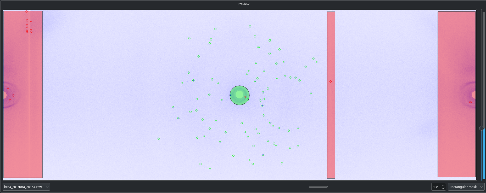
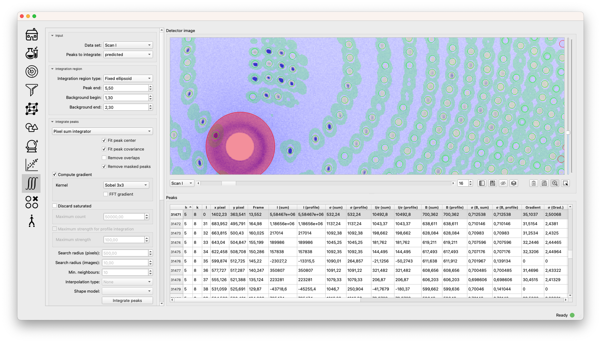

.. _workflow:

Workflow
========

The workflow in OpenHKL approximately follows the order of the icons in
the sidebar: find peaks, filter, autoindex, predict, refine, merge. The
``Home`` tab enables experiment creation and loading/saving, while
the ``Experiment`` tab allows inspection and editing of various aspects
of the physical experiment.

The virtual “experiment” is the highest level object, and contains all
information from the physical experiment (the data sets), plus any
derived/reduced data, such as the unit cell, peaks, indices, and merged
data statistics. This object can be saved at any stage in the workflow
by returning to the ``Home`` tab.

Home
----

The home tab shows a list of loaded experiments, and allows creation of
new experiments, the loading of a saved experiment state and saving an
existing experiment state.

-  ``Create new experiment`` opens a dialogue prompting the user to name
   the experiment and select the instrument used. The parameters
   specific to that instrument are loaded from a YAML-formatted
   instrument file found with the source code.

-  ``Load from file`` loads a ``hdf5`` file containing a *saved*
   experiment state.

-  ``Save current`` saves the current experiment state as a ``hdf5``
   file.

-  ``Save all`` saves all experiments in ``hdf5`` format.

There are three tables summarising the state of the experiment on the left hand
side of this window.

.. table:: Datasets

   +--------------------+----------------+-------------------------------+
   | **Column**         | Unit           | Description                   |
   +====================+================+===============================+
   | **Name**           |                | Name of the data set          |
   +--------------------+----------------+-------------------------------+
   | **Diffractometer** |                | Name of diffractometer used   |
   +--------------------+----------------+-------------------------------+
   | **Number of**      |                | Number of images in this      |
   | **frames**         |                | data set                      |
   +--------------------+----------------+-------------------------------+
   | **Number of**      | pixels         | Height of image in pixels     |
   | **rows**           |                |                               |
   +--------------------+----------------+-------------------------------+
   | **Number of**      | pixels         | Width of image in pixels      |
   | **columns**        |                |                               |
   +--------------------+----------------+-------------------------------+

.. table:: Peak collections

   +--------------------+----------------+-------------------------------+
   | **Column**         | Unit           | Description                   |
   +====================+================+===============================+
   | **Name**           |                | Name of the peak collection   |
   +--------------------+----------------+-------------------------------+
   | **Number of**      |                | Number of peaks in this       |
   | **peaks**          |                | collection                    |
   +--------------------+----------------+-------------------------------+
   | **Number of**      |                | Number of rejected peaks      |
   | **invalid peaks**  |                | in this collection            |
   +--------------------+----------------+-------------------------------+
   | **Is indexed**     |                | Whether peaks in this         |
   |                    |                | collection have Miller        |
   |                    |                | indices assigned              |
   +--------------------+----------------+-------------------------------+
   | **Is integrated**  |                | Whether peak in this          |
   |                    |                | collection have had           |
   |                    |                | intensities and sigmas        |
   |                    |                | calculated                    |
   +--------------------+----------------+-------------------------------+
   | **Type**           |                | Labels the peak collection    |
   |                    |                | as either ``found`` or        |
   |                    |                | ``predicted``                 |
   +--------------------+----------------+-------------------------------+

.. table:: Unit cells

   +--------------------+----------------+-------------------------------+
   | **Column**         | Unit           | Description                   |
   +====================+================+===============================+
   | **ID**             |                | Integer label of cell         |
   +--------------------+----------------+-------------------------------+
   | **Name**           |                | Name of the unit cell         |
   +--------------------+----------------+-------------------------------+
   | **Space group**    |                | Space group of cell           |
   +--------------------+----------------+-------------------------------+
   | **a**              | Å              | *a* cell parameter            |
   +--------------------+----------------+-------------------------------+
   | **b**              | Å              | *b* cell parameter            |
   +--------------------+----------------+-------------------------------+
   | **c**              | Å              | *c* cell parameter            |
   +--------------------+----------------+-------------------------------+
   | :math:`\alpha`     | degrees        | :math:`\alpha` cell angle     |
   +--------------------+----------------+-------------------------------+
   | :math:`\beta`      | degrees        | :math:`\beta` cell angle      |
   +--------------------+----------------+-------------------------------+
   | :math:`\gamma`     | degrees        | :math:`\gamma` cell angle     |
   +--------------------+----------------+-------------------------------+

Experiment
----------

Most information on the experiment can be found in this panel, including
settings for the instrument, the raw data sets, any computed unit cells and the
peak collections.

Raw data is loaded from this screen, by going to the "data" tab, clicking on the
green "+" and selecting the relevant data format. The file dialogue box can be
used to select multiple images if necessary, and these will be loaded in the
order they are sorted by the OS (normally numerically, but some care is
required). In the case of the raw data format (`.tiff` and `.nxs`), some
additional metadata is requested in a prompt dialogue.

.. table:: Raw data loader parameters

   +-------------------+----------------+-------------------------------+
   | **Parameters**    | Unit           | Description                   |
   +===================+================+===============================+
   | **Data**          | Row/column     | Specifies whether rows or     |
   | **arrangement**   | Major          | columns are contiguous in     |
   |                   |                | memory                        |
   +-------------------+----------------+-------------------------------+
   | **Data format**   | 8/16/32 bit    | Number of bits per pixel      |
   |                   |                | in raw images                 |
   +-------------------+----------------+-------------------------------+
   | **Swap endian**   | T/F            | Toggle endianness of data     |
   |                   |                | (big endian/little endian)    |
   +-------------------+----------------+-------------------------------+
   | **delta chi**     | degrees        | Angular stepping for sample   |
   |                   |                | angle :math:`\chi`            |
   +-------------------+----------------+-------------------------------+
   | **delta omega**   | degrees        | Angular stepping for sample   |
   |                   |                | angle :math:`\omega`          |
   +-------------------+----------------+-------------------------------+
   | **delta phi**     | degrees        | Angular stepping for sample   |
   |                   |                | angle :math:`\phi`            |
   +-------------------+----------------+-------------------------------+
   | **wavelength**    | Å              | Incident wavelength           |
   +-------------------+----------------+-------------------------------+

The detector image serves three purposes:

1. To adjust the intensity colour scale via the slider on the right
2. To mask regions of the image such as the beam stop or specific peaks, to
   exclude them from further processing
3. To plot intensity profiles along a line in the plotting panel at the bottom.

Find peaks
----------

The initial peak search is essentially a pure image processing step,
with no crystallographic input. The technique is roughly as follows

#. Apply an image filter to subtract local background

#. Apply a threshold to the resulting image

#. Find connected components (“blobs”) of the resulting thresholded
   image

#. Merge blobs that overlap, according to some cutoff

In the first step, we apply a filter which consists of a central
circular region with positive weight, and an outer annular region with
negative weight. The weights are chosen so that the convolution computes
the local average of the circular region subtracted by the average of
the annular region, effectively giving a local background subtraction.
The radii of the circle and annulus may be specified by the user.

To find connected components, we use a standard `blob detection
<https://en.wikipedia.org/wiki/Blob_detection>`_ algorithm. In the last step,
we compute inertia ellipsoids for each blob, and merge those blobs whose
ellipsoids overlap, after a user-defined scaling factor has been applied. The
merging process is repeated until there are no longer any overlapping
ellipsoids.

The collision detection problem for ellipsoids is sped up by storing
them in an octree. The ellipsoid overlap detection is implemented using
the criterion described in **TODO: find literature**.

.. _peakfinder:

The screenshot above demostrates masking the detector image to exclude invalid
regions from the peak search. The beam stop and the seam between detector plates
(thin white line in this context) have been masked using the masking tool in the
bottom right hand corner, such that any peaks found in these regions will be
rejected. The region around the beam stop containing the air scattering halo has
also been masked because the heterogeneous background will result in poor
integration.

.. table:: Peak search parameters

   +-------------------+----------------+-------------------------------+
   | **Parameters**    | Unit           | Description                   |
   +===================+================+===============================+
   | **Threshold**     | counts         | Pixels with a value below the |
   |                   |                | threshold are discarded       |
   +-------------------+----------------+-------------------------------+
   | **Merging scale** | :math:`\sigma` | Peak scale in sigmas, to      |
   |                   |                | detect collisions between     |
   |                   |                | blobs                         |
   +-------------------+----------------+-------------------------------+
   | **Minimum size**  | integer        | Blob is discarded if it       |
   |                   |                | contains fewer points than    |
   |                   |                | this                          |
   +-------------------+----------------+-------------------------------+
   | **Maximum size**  | integer        | Blob is discarded if it       |
   |                   |                | contains more points than     |
   |                   |                | this                          |
   +-------------------+----------------+-------------------------------+
   | **Maximum width** | frames         | Blob is discarded if it spans |
   |                   |                | more frames than this         |
   +-------------------+----------------+-------------------------------+
   | **Kernel**        |                | Convolution kernel for peak   |
   |                   |                | search                        |
   +-------------------+----------------+-------------------------------+
   | **Parameters**    |                | parameters                    |
   |                   |                | :math:`r_1, r_2, r_3` for the |
   |                   |                | :ref:`sec_pixelsum`           |
   +-------------------+----------------+-------------------------------+
   | **Start frame**   | frame          | Initial frame in range for    |
   |                   |                | peak finding                  |
   +-------------------+----------------+-------------------------------+
   | **End frame**     | frame          | Final frame in range for peak |
   |                   |                | finding                       |
   +-------------------+----------------+-------------------------------+

At this stage in the workflow, there are no available profiles to perform
profile integration. The found peaks are integrated at this stage using 
pixel sum integration :ref:`sec_pixelsum`, a simple summation of peak pixel
counts with a mean background subtraction.

The following three integration parameters are explained in detail in
:ref:`sec_peakshape` . Briefly, however, they are scaling factors that determine
the size of the ellipsoids representing the peak and background region. The
covariance matrix is scaled by a dimensionless :math:`\sigma^2`, such that an
ellipsoid scaled by a "peak end" of :math:`\sigma` contains 66.3% of points in
the ellipsoid, 95.4% for :math:`2\sigma` and 99.7% for :math:`3\sigma`. The
ellipsoids (projected to ellipses on the detector scene) can be visualised via
the "Show/hide" peaks widget.

.. table:: Integration parameters

   +-----------------+----------------+---------------------------------+
   | **Parameters**  | Unit           | Description                     |
   +=================+================+=================================+
   | **Peak end**    | :math:`\sigma` | End of peak region in detector  |
   |                 |                | coordinates                     |
   +-----------------+----------------+---------------------------------+
   | **Bkg. begin**  | :math:`\sigma` | Beginning of background region  |
   |                 |                | in detector coordinates         |
   +-----------------+----------------+---------------------------------+
   | **Bkg. end**    | :math:`\sigma` | End of background region in     |
   |                 |                | detector coordinates            |
   +-----------------+----------------+---------------------------------+

Filter peaks
------------

The filter peaks tab allows the user to remove peaks that meet certain
criteria froma collection and save this subset as a new collection. The
following controls cause the filter to catch that have:

State
   a specific (hidden) state flag set to “true”

   -  Selected — unselected peaks are generally unfit for integration
      for some reason

   -  Masked — a peak is masked if it has been manually highlighted on
      on the detector view

   -  Predicted — the peak has been predicted as opposed to found via
      the peak search algorithm

   -  Indexed — the peak has a unit cell assigned

Indexed peak
   been indexed (i.e. have a unit cell assigned)

Strength
   a strength (:math:`I/\sigma`) in the specified range

d range
   a d value (Å) in the specified range

Frame range
   a frame value (i.e. image number) in the specified range

Overlapping
   Remove pairs of peaks for which the intensity region ("peak end") overlaps an
   adjacent background region ("background end"). Set these to the same value to
   remove only overlapping intensity regions.

Rejection reason
   Remove all peaks other than those which the selected rejection reason.

Sparse dataset
   Remove peaks from data sets which contain too few peaks.

Merged peak significance
   Reject peaks which fail a chi squared test. If the probability of a peak
   having an intensity less than the chi squared of the intensities of the
   merged peaks of which it is a member is less than the expected variance, it
   is rejected.

Extinct from spacegroup
   Reject peaks that are forbidden by space group symmetry considerations. See
   :ref:`peaktable` for a detailed list of options, with explanations.

Note that the peak table contains an extra column on this widget, ``caught by
filter``. This allows the user to sort peaks caught by the filter to the top of
the peak table with a single click.

Autoindexing
------------

The unit cell is determined in this tab using the 1D Fourier transform
method :cite:`w-Steller1997`, and peaks are assigned Miller
indices. A unit cell is **required** for all subsequent sections of the
workflow.

The algorithm works as follows. We are given some set of
:math:`\mathbf{q}` vectors which lie approximately on a lattice, yet to
be determined. To find candidate lattice directions, we take a random
sample of directions. For each direction, we perform the orthogonal
projection of each :math:`\mathbf{q}` vector to the infinite line
specified by the direction. We then take a finite number of bins along
this line (the way the binning is performed can be controlled by
user-defined parameters), and then take FFT of the resulting histogram.
The histogram will be strongly periodic when the direction corresponds
to a lattice direction, so we identify lattice vectors by taking the
strongest Fourier modes of the histograms.

The FFT method produces a finite set of potential lattice vectors. To
find a basis, we enumerate over triples of these basis vectors and rank
them according to

#. The percentage of peaks that can be indexed (with integer indices)

#. The volume of the resulting unit cell

This provides a ranked list of candidate unit cells, from which the user
may choose.

.. table:: Autoindexing parameters

   +----------------------+---------------+-------------------------+
   | **Parameters**       | Unit          | Description             |
   +======================+===============+=========================+
   | **Frames**           | frame number  | Choose a limited subset |
   |                      |               | of images from the data |
   |                      |               | set. Fourier transform  |
   |                      |               | autoindexing tends to   |
   |                      |               | work best on a subset   |
   |                      |               | of images, typically    |
   |                      |               | :math:`\simeq` 5        |
   |                      |               | degrees of oscillation  |
   |                      |               | at the start of the     |
   |                      |               | range, or a few         |
   |                      |               | (:math:`\simeq 10`)     |
   |                      |               | frames.                 |
   +----------------------+---------------+-------------------------+
   | **D range**          | Å             | Peaks with q vectors    |
   |                      |               | outside this range will |
   |                      |               | not be using in         |
   |                      |               | indexing                |
   +----------------------+---------------+-------------------------+
   | **Strength**         |               | Peaks with strength     |
   |                      |               | (:math:`I/\sigma`)      |
   |                      |               | outside this range will |
   |                      |               | not be used in indexing |
   +----------------------+---------------+-------------------------+
   | **Gruber Tol.**      |               |                         |
   +----------------------+---------------+-------------------------+
   | **Niggli Tol.**      |               |                         |
   +----------------------+---------------+-------------------------+
   | **Find Niggli cell** | T/F           | Whether to find the     |
   |                      |               | Niggli primitive cell   |
   +----------------------+---------------+-------------------------+
   | **Max Cell dim.**    | Å             | Maximum length of *any* |
   |                      |               | lattice vector          |
   +----------------------+---------------+-------------------------+
   | **Q Vertices**       | integer       | Number of reciprocal    |
   |                      |               | space directions to     |
   |                      |               | search for lattice      |
   |                      |               | vector                  |
   +----------------------+---------------+-------------------------+
   | **Subdivisions**     | integer       | Number of reciprocal    |
   |                      |               | space bins for Fourier  |
   |                      |               | transform               |
   +----------------------+---------------+-------------------------+
   | **Unit Cells**       | integer       | Maximum number of unit  |
   |                      |               | cells to find           |
   +----------------------+---------------+-------------------------+
   | **Min Volume**       | Å\ :math:`^3` | Minimum unit cell       |
   |                      |               | volume                  |
   +----------------------+---------------+-------------------------+
   | **Indexing Tol.**    |               |                         |
   +----------------------+---------------+-------------------------+
   | **Frequency Tol.**   | 0.0 - 1.0     | Minimum fraction of     |
   |                      |               | amplitude of the zeroth |
   |                      |               | Fourier frequency to    |
   |                      |               | accept as a candidate   |
   |                      |               | lattice vector          |
   +----------------------+---------------+-------------------------+

The FFT indexing method can be difficult to use correctly because there
is no systematic method for reaching the correct solution, and there are
many adjustable parameters. As a guide, the follwing tend to have a
substantial effect on the success (or otherwise) of the procedure:

#. Number of peaks/number of frames: using too many peaks/frames tends
   to result in failure. This is obviously strongly dependent on the
   nature of the sample. For example, using the BioDiff detector, up to
   10 frames, containing no more than 300 peaks seems to be sufficient
   to index complicated biological crystals.

#. Subdivisions: The process is strongly dependent on the number of FFT
   histogram bins.

#. Q Vertices: This is the parameter that is most easy to systematically
   vary, since more Q vectors will increase the likelihood of finding
   one that is parallel to the normal to a lattice plane. Increasing
   this value will usually (but not invariably) enhance the odds of
   finding a lattice vector.

#. Frequency Tol: the FFT algorithm will discard any candidate
   reciprocal lattice vector whose amplitude is less than this fraction
   of the zeroth Fourier frequency. Use with care!

The closest unit cell can then be selected as a row from the table of solutions
and assigned to a peak collection (usually the collection of *found* peaks. Note
that it is important to find the cell with the correct centering (Bravais type)
or the correct space group may not be visible in the list in the `Assign unit
cell` dialogue box. This may require additional experimentation with the
parameters.

In practice, the position of the direct beam is the parameter that usually
determines the success of this algorithm. In the first instance, OpenHKL will
assume that the direct beam position is at the exact centre of the detector
image, when it is in fact likely to be off by a few pixels, enough to prevent
the algorithm from finding a solution. At this stage, we have no unit cell, so
refinement is not an option, leaving the option of manually adjusting the direct
beam position. This can be done by checking the "set initial direct beam
position" box and dragging and dropping a crosshair in the detector scene. The
"x offset" and "y offset" boxes show the offset in pixels from the centre of the
image, and the "crosshair size" and "crosshair linewidth" controls offer a guide
to the eye when determining the

.. _directbeam:
.. figure:: images/workflow/direct_beam.png
   :alt: Adjusting the direct beamm position manually
   :name: fig:direct_beam
   :width: 100.0%

An example of this procedure is shown above. The air scattering halo in this
instance can be used to give a better estimate of the direct beam position,
which is off by 2-3 pixels in each direction. This small adjustment is enough to
successfuly find the correct unit cell, orientation and Bravais lattice with the
default autoindexing parameters.

.. _sec_shape_model:

Shape model
-----------

The details of the shape model are explained in :ref:`sec_peakshape`, but for
the purposes of this section it is enough to know that each peak is modeled as
an ellipsoid extending over several frames (specifically over a finite sample
rotation angle). The shape model is intended to define the shape of peaks which
do not have strong intensity regions on the detector image, and whose shape
(covariance matrix) is unknown, even though the position of the centre of the
peak is known. A shape model is constructed by adding the shapes of *strong*
peaks from a peak collection to a "library"; this model can be used to predict
the shape of the peak with its centre at given coordinates by taking the mean of
the covariance matrix of the neighbouring peaks, within a cutoff.

   +------------------------+----------------+-------------------------+
   | **Parameters**         | Unit           | Description             |
   +========================+================+=========================+
   | **histogram bins**     | integer        | Number of histogram     |
   | **x/y/z**              |                | bins for profile in     |
   |                        |                | x/y/z direction         |
   +------------------------+----------------+-------------------------+
   | **Kabsch coordinates** | T/F            | Toggle Kabsch           |
   |                        |                | coordinate system as    |
   |                        |                | opposed to detector     |
   |                        |                | coordinate system       |
   |                        |                | (applies only to        |
   |                        |                | Profile 3D and Profile  |
   |                        |                | 1D integrators)         |
   +------------------------+----------------+-------------------------+
   | Beam divergence        |                | Peak variance due to    |
   | :math:`\sigma`         |                | beam divergence         |
   +------------------------+----------------+-------------------------+
   | Mosaicity              |                | Peak variance due to    |
   | :math:`\sigma`         |                | crystal mosaicity       |
   +------------------------+----------------+-------------------------+
   | **Minimum**            |                | Exclude weak peaks with |
   | I/:math:`\sigma`       |                | strength                |
   |                        |                | (I/:math:`\sigma`)      |
   |                        |                | below this value        |
   +------------------------+----------------+-------------------------+
   | **Minimum d**          | Å              | Only include peaks      |
   |                        |                | above this d value      |
   +------------------------+----------------+-------------------------+
   | **Maximum d**          | Å              | Only include peaks      |
   |                        |                | below this d value      |
   +------------------------+----------------+-------------------------+
   | **Peak end**           | :math:`\sigma` | Size of peak region     |
   +------------------------+----------------+-------------------------+
   | **Background begin**   | :math:`\sigma` | Size of beginning of    |
   |                        |                | background region       |
   +------------------------+----------------+-------------------------+
   | **Background end**     | :math:`\sigma` | Size of end of          |
   |                        |                | background region       |
   +------------------------+----------------+-------------------------+
   |                        |                |                         |
   +------------------------+----------------+-------------------------+
   | **x/y**                | pixels         | Compute mean profile    |
   |                        |                | for these detector x/y  |
   |                        |                | coordinates             |
   +------------------------+----------------+-------------------------+
   | **Frame**              | frame          | Compute mean profile    |
   |                        |                | for this frame          |
   |                        |                | coordinate coordinates  |
   |                        |                | (with x/y)              |
   +------------------------+----------------+-------------------------+
   | **Radius**             | pixels         | Detector image radius   |
   |                        |                | for neighbour search    |
   |                        |                | for computing mean      |
   |                        |                | profile                 |
   +------------------------+----------------+-------------------------+
   | **N frames**           | frame          | Detector image radius   |
   |                        |                | in frames for neighbour |
   |                        |                | search for computing    |
   |                        |                | mean profile            |
   +------------------------+----------------+-------------------------+
   | **Interpolation type** |                | Type of interpolation   |
   |                        |                | to use when calculating |
   |                        |                | mean covariance         |
   +------------------------+----------------+-------------------------+

The number of histogram bins in the x/y/z directions do affect the shape
model, they only control the grid over which the predicted shape is plottied int
he "shape preview" widget. The preview is constructed for a single peak at
coordinates :math:`(x, y, \mathrm{frame})`, and all neighbouring strong peaks
with in the specified pixel and frame cutoff are used to compute the mean
covariance matrix. This peak is shown in the shape preview widget, and can also
be displayed in the detector image widget if the coordinates are chosen by
clicking somewhere on the detector image. When shown on the detector image, the
shape is plotted as an integration region, with bounds determined by the "peak
end", "background begin" and "background end" parameters. The peak pixels for
this region are highlighted in yellow, and the local background pixels in green.

.. _shapemodel:
.. figure:: images/workflow/shape_model.png
   :alt: Visualising a shape generated from a shape model
   :name: fig:shape_model
   :width: 100.0%

An example of a shape generated from a model is shown above: clicking on a peak
from the selected *predicted* peak collection ("target peak collection")
displays the integration region for the shape int he Preview widget, and plots

Note that in order to display the integration region, there must be a predicted
peak collection ("target peak collection") to which the shape model can be
applied, and a saved shape model.

The beam divergence and mosaicity variances are estimated as in section
:ref:`beam_profile`. The beeam divergence variance :math:`\sigma_D` affects the
spread of the detector spot in the plane of the detector image, and the
mosaicity variance :math:`\sigma_M` affects the spread in the direction of the
frames (i.e. the sample rotation axis). These parameters can be adjusted to
control the extent of the detector spots if it seems that the model is not
representative of the detector images. Physically, :math:`\sigma_M` will change
the number of spots on an image since with a higher value they will extend onto
more frames, and a higher :math:`\sigma_D` will increase the size of the
integration regions.

.. _predict-peaks-1:

Predict peaks
-------------

Given the unit cell, an exhaustive set of Miller indexed reflections can
be generated within the specified d range. Space group-forbiden reflections can
then be removed from theis collection.

A complete set of Miller index :math:`(hkl)` triples is generated withing a
given resolution range, then for each triple, a reciprocal space vector
:math:`\mathbf{q}` is computed by multiplying the :math:`(hkl)` vector by the
reciprocal basis. For each :math:`\mathbf{q}`, the rotation angle at which it
intersects the Ewald sphere is located using a bisection algorithm (essentially
finding the non-integer frame coordinate at which the sign of
:math:`\mathbf{k}_f - \mathbf{k}_i` changes, bearing in mind that this can
happen more than once over the rotation range.

.. table:: Peak prediction parameters

   +------------------+--------+----------------------------------------+
   | **Parameters**   | Unit   | Description                            |
   +==================+========+========================================+
   | **Unit cell**    |        | Unit cell to predict peaks from        |
   +------------------+--------+----------------------------------------+
   | **Interpolation**|        | Interpolation type for shape model     |
   +------------------+--------+----------------------------------------+
   | **d min**        | Å      | Only include peaks above this d value  |
   +------------------+--------+----------------------------------------+
   | **d max**        | Å      | Only include peaks below this d value  |
   +------------------+--------+----------------------------------------+
   | **Show direct**  | T/F    | Show the position of the direct beam   |
   | **beam**         |        | (incident wavevector) on the detector  |
   |                  |        | image                                  |
   +------------------+--------+----------------------------------------+

As in the autoindexing step, the positions of the predicted peaks are very
sensitive to the position of the direct beam. Since we now have the unit cell,
it is possible to refine the direct beam position using least squares
minimisation, as described in :ref:`sec_refine`.

At this point, the predicted peaks (detector spots) have a position, but no
shape. A saved shape model (generated in :ref:`sec_shape_model`) can be applied
to the predicted peaks.

For the purposes of refinement, it is extremely important to assign a shape
model to the predicted peak collection. Each peak can be considered to be an
ellipsoid in real space, and the detector spots are ellipses where the ellipsoid
intersects the detector image. In general , the principle axes of ellipsoid will
not coincide with the plane of the detector image, and as a result the ellipse
for a single peak will generally have differenct centre coordiinates on each
frame on which it appears (this results in the "precession" of the spot across
the detector if one scrolls through the images). If we do not have a good
initial guess for the shape of the ellipsoid before refinement, then it will be
impossible for the refiner to improve the positions of the detector spots across
all frames. This can be seen by comparing the integration regions of a predicted
peak before and after the shape model is assigned.

.. _preshapemodel:

.. _postshapemodel:

If a shape is not assigned, the predicted peak retains its default shape
(spherical), which will be grossly inaccurate.

.. _sec_refine:

Refine
------

In this tab, nonlinear least-squares minimisation is used to find the unit cell
and instrument states that best fit the given peak collection. The instrument
states optimised are the detector position offset, the sample position offset,
the sample orientation offset and the incident wavevector.

Since detector images are generated over a period of time as well as over an
angular range, the conditions of the experiment may have changed between the
first frame and the last, for example, the temperature, which would affect the
unit cell. As such the peaks are refined in batches, each encompassing a few
frames in a limited subset of the angular range of the experiment. For example,
if we specify 10 batches for an experiment with 100 frames (detector images), we
will get 10 sets of equal numbers of peaks in partially overlapping but distinct
angular ranges.

The change in each of these quantities can be plotted as a function of frame (or
equivalently angle) in the bottom panel. The per-frame values for the unit cell
and each instrument state before and after refinement are visible in the tables.

The refinement uses the non-linear least squares minimisation routines from the
Gnu scientific library (GSL). The free parameters as determined by the checkboxes
under ``parameters to refine`` are varied such that the sum of residuals is
minimised. These residuals can be computed in two ways, and can be changed using
the ``residual type`` combo:

1. Real space --- the residual is computed as the difference in real space (i.e.
   detector coordinates) between the integer Miller indices and floating point
   Miller indices.

2. Reciprocal space --- the residual is computed as the difference in reciprocal
   space between the integer Miller indices and floating point Miller indices.

These are described in :cite:`w-Leslie2005`.

.. table:: Refiner parameters

   +------------------------+---------+-----------------------------------------+
   | **Parameters**         | Unit    | Description                             |
   +========================+=========+=========================================+
   | **Use refined cell**   | T/F     | Use unit cells from previous refinement |
   +------------------------+---------+-----------------------------------------+
   | **Number of batches**  | integer | Split peaks into this number of batches |
   +------------------------+---------+-----------------------------------------+
   | **Maximum iterations** | integer | Maximum number of iterations for least  |
   |                        |         | squares minimisation                    |
   +------------------------+---------+-----------------------------------------+
   | **Residual type**      |         | Switch between residual types for       |
   |                        |         | least squares minimisation              |
   +------------------------+---------+-----------------------------------------+

After refinement, clicking ``Update`` in the `Update predictions` panel will
update the peak centre coordiates that changed as a result of unit cell and
instruement state refinement. The change in peak centre coordinates after
refinement is usually significant, as shown in the example below (pre-refinement
positions are shown in dark green, post-refinement positions in light green).

.. _refinement:

Both the found and predicted peaks should then be reintegrated.

Note that floating point Miller indices are generated from the "found" peaks,
i.e. the peaks derived from image processing. The predicted peaks by definition
have integer Miller indices, and are purely a function of the unit cell and
instrument states. Thus the peak collection undergoing refinement will always be
a "found" collection.

Under the ``tables`` tab, the values of each free variable is shown before (left)
and after (right) refinement. By switching to the ``detector`` tab, the change in
the peak centres before and after refinement can be visualised.

.. _sec_integration:

Integrate peaks
---------------

In this section, the peaks, usually a set of *predicted* peaks, are integrated
to compute their intensities and variances (sigmas). Integrating a predicted
peak collection using the basic pixel sum integrator is unreliable because many
(indeed, most) of the predicted peaks will have intensities that are difficult
to distinguish from the background, and simply summing the pixels and
subtracting the background will give a poor estimate. Thus, profile integration
is used, in which the integral is a function of the pixel values on the detector
image, and the intensities of the nearby strong peaks.

Note that only the parameters ``Peak end``, ``Bkg begin`` and ``Bkg end``
apply to pixel sum integration; the rest are specific to profile fitting
integration.

.. table:: Integration parameters

   +------------------------+----------------+----------------------------------+
   | **Parameters**         | Unit           | Description                      |
   +========================+================+==================================+
   | **Discard saturated**  | T/F            | Discard peaks containing pixels  |
   |                        |                | with counts overflowing the      |
   |                        |                | specified maximum                |
   +------------------------+----------------+----------------------------------+
   | **Maximum counts**     | counts         | Maximum possible counts per      |
   |                        |                | pixel before peak is discarded   |
   +------------------------+----------------+----------------------------------+
   | **Fit the center**     | T/F            | Whether to fit the peak center   |
   +------------------------+----------------+----------------------------------+
   | **Fit the covariance** | T/F            | Whether to fit the covariance    |
   +------------------------+----------------+----------------------------------+
   | **Peak end**           | :math:`\sigma` | End of peak region in detector   |
   |                        |                | coordinates                      |
   +------------------------+----------------+----------------------------------+
   | **Bkg begin**          | :math:`\sigma` | Beginning of background region in|
   |                        |                | detector coordinates             |
   +------------------------+----------------+----------------------------------+
   | **Bkg end**            | :math:`\sigma` | End of background region in      |
   |                        |                | detector coordinates             |
   +------------------------+----------------+----------------------------------+
   | **Minimum d**          | Å              | Only include peaks               |
   |                        |                | above this d value               |
   +------------------------+----------------+----------------------------------+
   | **Maximum d**          | Å              | Only include peaks               |
   |                        |                | below this d value               |
   +------------------------+----------------+----------------------------------+
   | **Search radius**      | pixels         | Detector image radius in pixels  | 
   |                        |                | for neighbour search for         |
   |                        |                | computing mean profile           |
   +------------------------+----------------+----------------------------------+
   | **N. of frames**       | frame          | Detector image radius in frames  |
   |                        |                | for neighbour search for         |
   |                        |                | computing mean profile           |
   +------------------------+----------------+----------------------------------+
   | **Min. neighbours**    | integer        | Minium number of neighbours      |
   |                        |                | within the cutoffs above required|
   |                        |                | to compute mean shape            |
   +------------------------+----------------+----------------------------------+

.. _integration:

A 16 bit detector image will be able to display a maximum of 65535 counts, so in
some cases there is a numerical limit on the number of counts per pixel.
Moreover, it is possible for the detector to be overexposed, resulting in
"saturated" pixels. Such pixels will result in incorrect integrated intensities,
so in cases where an accurate integration is required, peaks containing such
pixels should be rejected. This is the rationale behind the ``Discard
saturated`` option.

When a shape collection is generated using the *Build shape collection* button
(see :ref:`sec_shape_collection`, the computed collection can be used to assign
shapes to a peak collection. For each peak in the collection, the shape is
computed as the mean covariance of all neighbouring peaks within the given
cutoffs (range, i.e. number of pixels on the detector image, and radius, i.e.
number of frames).

The ``Peak interpolation`` combo sets the type of interpolation to use when
computing the shape of a peak. A predicted peak is given a shape that is the
mean of all *found* peaks in a given radius of pixels on the detector image and
rotation increments (i.e. frames). When computing the mean, the neighbouring
peak contributes with a weight determined by the chosen peak interpolation
method. For ``none``, all peaks are given a weight of 1.0. For ``inverse distance``,
the neighbouring peak is given a weight of the inverse of the distance from the
reference peak in reciprocal space, i.e. peaks that are further away in
reciprocal space have a lower weight. For ``intensity``, the neighbouring peak is
weighted by its intensity divided by its variance, i.e. weaker peaks have a lower
weight.

The ``remove overlaps`` checkbox will remove any instances of the peak
(intensity) region of a peak intersecting with an adjacent peak region, since
this will obviously result in inaccurate integrated intensities for both. Note
that peak pixels are automatically removed from local background calculations,
so background calculations are not ruined by intruding peak intensity regions.
It is also possible to prevent overlaps by modifying the integration region
parameters "peak end", "background begin" and "background end". These
respectively affect the scaling of the peak region, the start of the background
region and the end of the background region respectively.

Merge peaks
-----------

This section displays the results of the data reduction process: a set of
indexed and integrated peaks, with statistics to determine whether the process
yielded a sensible result. The quality statistics are visible in the ``D-shell
statistics`` tab, and all peaks in their merged and unmerged representations in
their respective tabs.

The interface makes it possible to merge two peak collections, although only one
is normally used. By selecting a peak collection in ``peak collection 1``, any
symmetry-related peaks are merged into one; the number of peaks merged is the
"redundancy". The R-factor CC quality metrics are meant to sanity-check the
data, which are available to save in a merged or unmerged representation.

D-shell statistics tab
~~~~~~~~~~~~~~~~~~~~~~

The data quality metrics described in :ref:`dataquality` are computed under the
"Merger" tab, and tabulated as a function of resolution shell (including a row
for the whole resolution range). These measures can be plotted as a function of
resolution in the panel at the bottom.

The sphere in q-space defined by ``d range`` is divided into a number of
concentric resolution shells of equal reciprocal volume, determined by ``number
of d-shells``. For each shell and the overall volume, R-factors and CC values
are calculated, allowing the user to determine the maximum resolution (if any)
to which the data set is reliable. The merger is controlled by the following
parameters.

.. _merge:

Not that it is possible for the user to only merge peaks in a specific frame
range; the rationale for this is that it may be better to ignore peaks on the
first and last frames, for which it is impossible to interpolate the frame
coordinate.

.. table:: Merge statistics parameters

   +------------------------+----------------+-------------------------+
   | **Parameters**         | Unit           | Description             |
   +========================+================+=========================+
   | **d range**            |  Å             | Only include peaks      |
   |                        |                | inside this d range     |
   +------------------------+----------------+-------------------------+
   | **frame range**        | integer        | Only include peaks      |
   |                        |                | inside this frame range |
   +------------------------+----------------+-------------------------+
   | **Number of d-shells** | integer        | Number of resolution    |
   |                        |                | shells to divide into   |
   +------------------------+----------------+-------------------------+
   | **Include Friedel**    | T/F            | Whether to include the  |
   |                        |                | Friedel relation if not |
   |                        |                | part of the space group |
   |                        |                | symmetry                |
   +------------------------+----------------+-------------------------+
   | **Plot axis**          |                | Value to plot on the    |
   |                        |                | y axis                  |
   +------------------------+----------------+-------------------------+

The tabulated statistics are comprised of the following fields:

.. table:: Merge statistics fields

   +-------------------+-----------------------------------------------+
   | **abbreviation**  | Description                                   |
   +===================+===============================================+
   | **dmax**          | Maximum value of d for this resolution shell  |
   |                   |                                               |
   +-------------------+-----------------------------------------------+
   | **dmin**          | Minimum value of d for this resolution shell  |
   |                   |                                               |
   +-------------------+-----------------------------------------------+
   | **nobs**          | Number of observed peaks in shell             |
   |                   |                                               |
   +-------------------+-----------------------------------------------+
   | **nmerge**        | Number of merged (i.e. symmetry-unique) peaks |
   |                   | in shell                                      |
   +-------------------+-----------------------------------------------+
   | **redundancy**    | Average peak redundancy (nobs/nmerge)         |
   |                   |                                               |
   +-------------------+-----------------------------------------------+
   | **Rmeas**         | see :ref:`dataquality`                        |
   |                   |                                               |
   +-------------------+-----------------------------------------------+
   | **Rmeas(est)**    | see :ref:`dataquality`                        |
   |                   |                                               |
   +-------------------+-----------------------------------------------+
   | **Rmerge/Rsym**   | see :ref:`dataquality`                        |
   |                   |                                               |
   +-------------------+-----------------------------------------------+
   | **Rmerge(est)**   | see :ref:`dataquality`                        |
   |                   |                                               |
   +-------------------+-----------------------------------------------+
   | **Rpim**          | see :ref:`dataquality`                        |
   |                   |                                               |
   +-------------------+-----------------------------------------------+
   | **Rpim(est)**     | see :ref:`dataquality`                        |
   |                   |                                               |
   +-------------------+-----------------------------------------------+
   | **CChalf**        | see :ref:`dataquality`                        |
   |                   |                                               |
   +-------------------+-----------------------------------------------+
   | **CC\***          | see :ref:`dataquality`                        |
   |                   |                                               |
   +-------------------+-----------------------------------------------+
   | Completeness      | Number of valid peaks / total number of peaks |
   |                   |                                               |
   +-------------------+-----------------------------------------------+

A high quality data set will have R-factors close to zero, CC values close to
one and a completeness close to 100\%.
   

Merged representation tab
~~~~~~~~~~~~~~~~~~~~~~~~~

A list of merged peaks is displayed in this section.

.. table:: Merged representation fields

   +--------------------+----------------------------------------------+
   | **abbreviation**   | Description                                  |
   +====================+==============================================+
   | **h**              | *h* Miller index                             |
   |                    |                                              |
   +--------------------+----------------------------------------------+
   | **k**              | *k* Miller index                             |
   |                    |                                              |
   +--------------------+----------------------------------------------+
   | **l**              | *l* Miller index                             |
   |                    |                                              |
   +--------------------+----------------------------------------------+
   | **I**              | Integrated intensity                         |
   |                    |                                              |
   +--------------------+----------------------------------------------+
   |   :math:`\sigma`   | Variance of integrated intensity             |
   |                    |                                              |
   +--------------------+----------------------------------------------+
   | **nobs**           | Redundancy of this peak (number of symmetry  |
   |                    | equivalents)                                 |
   +--------------------+----------------------------------------------+
   | :math:`\chi^2`     | The chi-squared intensity of the merged peak |
   |                    |                                              |
   +--------------------+----------------------------------------------+
   | **p**              | Probability that the intensity takes a value |
   |                    | less than the chi-squared                    |
   +--------------------+----------------------------------------------+

The merged peaks can be saved to ShelX, FullProf or Phenix format. The Phenix
format is fixed width, and some instruments such as BioDiff have a
photomultiplier, meaning that one count on the detector corresponds not to one
neutron, but some factor greater than one. This can cause the intensities to
become too large for the column, and make them unreadable by Phenix. The
``intensity scale factor`` control allows the user to post-multiply the
intensity and its associated variance by some factor such that the columns no
longer overlap.

Unmerged representation tab
~~~~~~~~~~~~~~~~~~~~~~~~~~~

A list of unmerged peaks is displayed in this section.

.. table:: Unmerged representation fields

   +--------------------+----------------------------------------------+
   | **abbreviation**   | Description                                  |
   +====================+==============================================+
   | **h**              | *h* Miller index                             |
   |                    |                                              |
   +--------------------+----------------------------------------------+
   | **k**              | *k* Miller index                             |
   |                    |                                              |
   +--------------------+----------------------------------------------+
   | **l**              | *l* Miller index                             |
   |                    |                                              |
   +--------------------+----------------------------------------------+
   | **I**              | Integrated intensity                         |
   |                    |                                              |
   +--------------------+----------------------------------------------+
   | :math:`\sigma`     | Variance of integrated intensity             |
   |                    |                                              |
   +--------------------+----------------------------------------------+
   | **x**              | x coordinate of peak (pixels)                |
   |                    |                                              |
   +--------------------+----------------------------------------------+
   | **y**              | y coordinate of peak (pixels)                |
   |                    |                                              |
   +--------------------+----------------------------------------------+
   | **frame**          | frame coordinate of peak (frames)            |
   |                    |                                              |
   +--------------------+----------------------------------------------+

The unmerged peaks can be saved to ShelX, FullProf or Phenix format. The Phenix
format is fixed width, andsome instruments such as BioDiff have a
photomultiplier, meaning that one count on the detector corresponds not to one
neutron, but some factor greater than one. This can cause the intensities to
become too large for the column, and make them unreadable by Phenix. The
``intensity scale factor`` control allows the user to post-multiply the
intensity by some factor such that the columns no longer overlap.

.. bibliography:: references.bib
    :cited:
    :labelprefix: W
    :keyprefix: w-
    :style: unsrt

Go to :ref:`top <workflow>`.
